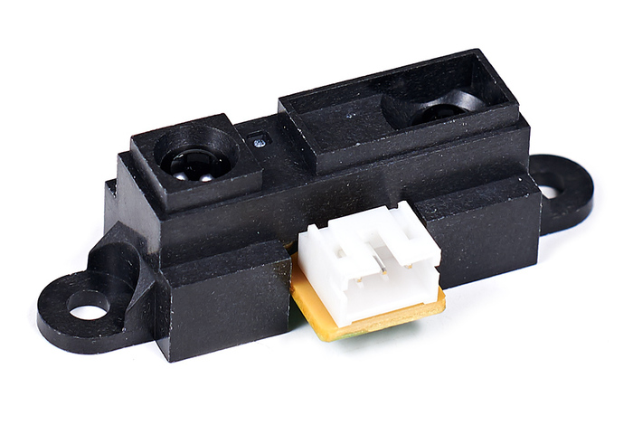
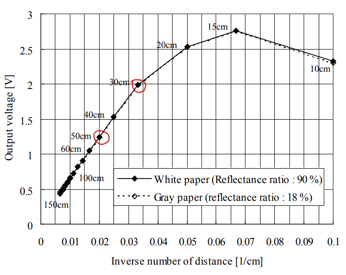
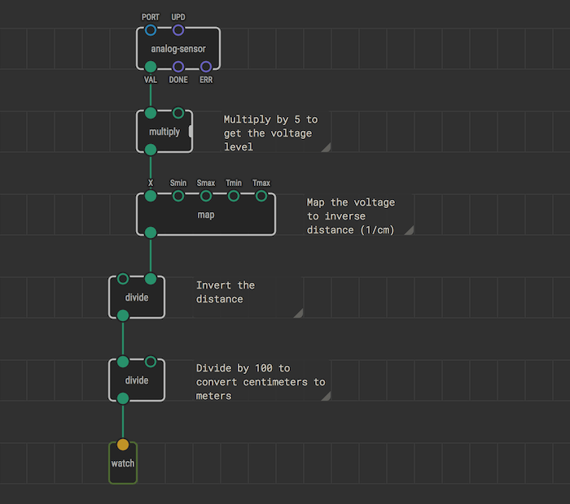
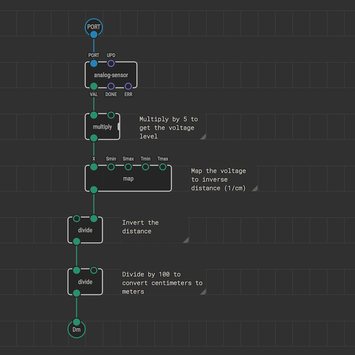
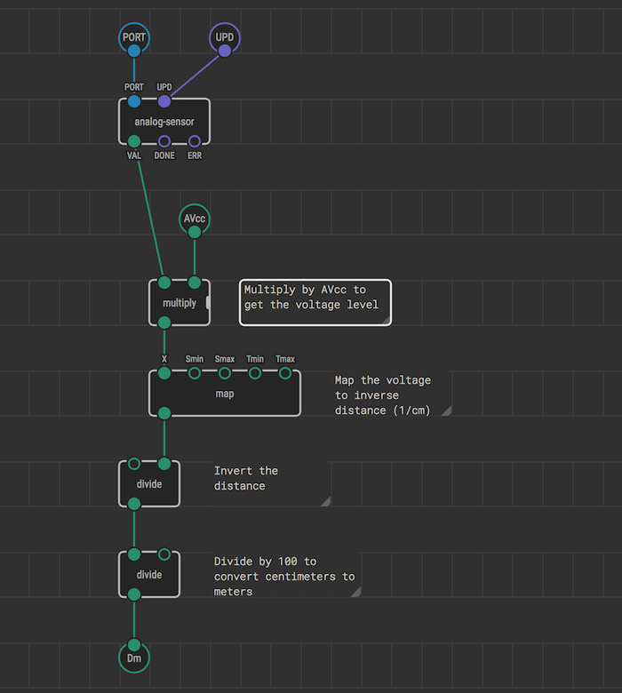
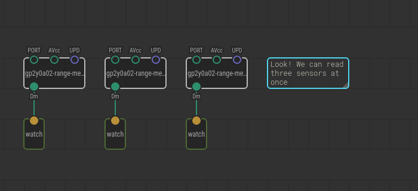

# Creating Analog Sensor Driver Nodes

Many sensors provide measured values as voltage levels. A board can read the
voltage level and perform some calculations to convert the voltage to
reasonable units.

This article guides you through a process of adding support for such sensor. To
do this, we’re going to create a new patch node. It is implied that you already
know [how to create patch nodes](../nodes-for-xod-in-xod/).

Start with creating a new project, or open the project you worked on while
learning to develop patch nodes.

## The task

To demonstrate the process, let's create a new node to read a popular GP2Y0A02
(yep, not a very elegant name) infrared range meter by Sharp. This guy:

Our purpose is a node which provides distance to an obstacle in meters.
Actually, the `xod/common-hardware` library already contains the node, but for
the sake of example, let’s imagine there is no such node yet.

## Pull useful data from a single sensor

First, read the [datasheet](./gp2y0a02-datasheet.pdf) and understand the math
behind voltage-to-value conversion.

In our particular case, we see that the “Inverse number of distance” almost
linearly depends on “Output voltage” in sensor’s working range (20 to 150
centimeters). The points outlined in red are on the grid and thus convenient to
build a proportion. Finally, our computation plan is:

- Convert analog input value to a voltage level value
- Map the voltage to inverse distance: [1.25, 2.00] → [0.020, 0.033]
- Invert the distance
- Convert centimeters to meters

Note
Although the last item is optional, it is a good practice. Operating in SI
units space removes many ambiguities, simplifies node replacement, and data
interchange.

So, in XOD we need to read analog values from the sensor, do the math, and
we’ll get desired distance value in meters. While testing, use the
[`watch`](/libs/xod/core/watch/) nodes to observe the results and verify
correctness. Here is our patch:

Bind the `PORT` value of `analog-sensor` to the board pin number you’ve
connected the sensor. Upload with debugger enabled, slowly move a book or sheet
of paper ahead of the sensor and observe value change. Do measurements look
realistic? Cool! We have a “body” for our new node.

## Wrap the reading into a node

The current program works but has the `PORT` value hard-coded and contains the
`watch` node not everyone would be interested in. Let’s move from the draft to
a complete solution.

Create a new patch and name it like `gp2y0a02-range-meter`.

Note
We recommend to follow <code>⟨cryptic-part-id⟩-⟨human-name⟩</code> naming convention. It
simplifies further node search and identification on a patch.

As you did before, cut/paste all nodes except the `watch` from the `main` patch
to the `gp2y0a02-range-meter`. Again, we need few terminals to interact with
the node. At the very least they are `PORT` value and the result. Don’t forget
to give them sensible labels.

Switch back to the `main`. Drag and drop the `gp2y0a02-range-meter` node there.
That’s our range meter, and it provides distance values. Link its output pin to
the `watch`. Upload the program with the debugger and verify the `watch` shows
actual distance.

## Allow more tweaks

Also, not every board has 5 volts as it’s upper measurement limit. Some use 3.3
volts; others depend on a battery charge. It is a fact not related much to our
node, so we’ll let a user specify ADC voltage. Extra `input-number` would make
it configurable.

One more thing. It’s highly recommended to expose the update (`UPD`) input as
well. That way a node user can control when and high often to read the sensor.
Use an `input-pulse` for it.

## Set the defaults

Although measured voltage setting is up to a user from now on, we want to
provide a sensible default for it: 5 volts. The value will be used until a user
overrides it. To bind a default value, select the terminal node and set the
desired value in the Inspector.

Likewise, set the default value for the `UPD` terminal to “Continuously.”

## The result

We have made a complete solution to read a particular sensor model. Next time
you would hook range meters into a project you have not to recall all the math
behind the raw signal conversion.

Now you should be able to make similar nodes for dozens of sensors. The
difference is in math only. Consult the part datasheet to understand it.
