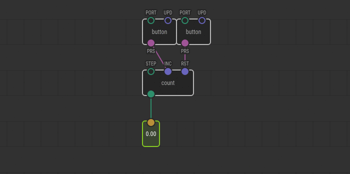

# Dealing with State in C++

Nodes outputs of which depend _solely_ on their inputs in at any point of time
are cool. They easy to understand, test, and compose. But building a useful
device using only such pure nodes is not realistic. Someone needs to keep state
along program run time.

A node can define state data that will persist for the time the program
executes. In other words, a node can put some value to the state in
`evaluate` call and retrieve that value in any of subsequent `evaluate`
invocations.

## The task

Let’s make a simple `count` node that will increment a value by one each time a
pulse is sent to it. Also, we’ll make the step size configurable and provide a
pulse input to reset the counter to zero.

<div class="ui segment note">
<span class="ui ribbon label">Note</span>
XOD standard library already includes <a
href="/libs/xod/core/count/"><code>xod/core/count</code></a>
node with similar functionality. But let’s forget about it for a moment.
</div>

## Prepare the node

As always, when you [make a C\++ node](../nodes-for-xod-in-cpp), start with a
new patch, add required terminals, and the `not-implemented-in-xod` node.


It’s a good idea to provide a resonable default value for `STEP`. We’ll set
it to 1.

Double-click on `not-implemented-in-xod` node to open the code editor.

## Define a state shape

You define the persistent state using the `State` struct in C\++. In our case,
we need to store a single counter value, so our struct will have a single field.
Let’s call it `counterValue`:

```cpp
struct State {
    Number counterValue = 0;
};
```

All state values, regardless of type, start with their default values. The
default value for numbers is `0` anyway, so this initialization of
`counterValue` through assignment is not required. Although the definition of
the field is necessary, of course. We set it to `0` here just to demonstrate a
possibility to initialize with another value like `42`.

## Accessing state

Now you can use `getState(Context ctx)` function to access the persistent state
instance associated with the context node. The outline is:

```cpp
// ...

void evaluate(Context ctx) {
    State* state = getState(ctx);

    // Read
    Number x = state->counterValue;

    // Do some magic with `myCounter`

    // Write
    state->counterValue = x;
}
```

The `state` is just a plain pointer to the `State` instance. Of course, you may
use its fields directly without any intermediate variables.

## Put all together

As you know from [Data types](../data-types/) article pulses have no values. To
check whether a pulse on the pin was fired in the current transaction we should
use [`isInputDirty`](/docs/reference/node-cpp-api/#isInputDirty) function, not
`getValue`. It doesn’t read values, instead it returns `true` if an upstream
node just emitted a new value for the pin specified.

Finally, here is an example implementation of our counter:

```cpp
struct State {
    Number counterValue;
};

\{{ GENERATED_CODE }}

void evaluate(Context ctx) {
    State* state = getState(ctx);

    if (isInputDirty<input_INC>(ctx)) {
        // Update the state
        Number step = getValue<input_STEP>(ctx);
        state->counterValue += step;
    } else if (isInputDirty<input_RST>(ctx)) {
        // Reset the state
        state->counterValue = 0;
    } else {
        // The evaluation caused by `STEP` update. Do nothing, return early to
        // avoid emission of a duplicate value.
        return;
    }

    // Emit the updated value accessing the field directly.
    emitValue<output_OUT>(ctx, state->counterValue);
}
```

## Moving state to outputs

The `State` struct is not the only thing which keeps data across transactions.
Any node owns its output value as well. And the
[`getValue`](/docs/reference/cpp-node-api/#getValue) function is allowed to
access the most recent values set on outputs.

In our case, the `OUT` value always matches the value we store in `State`. So
it’s a duplication we can get rid off to save few bytes of RAM and make the code
more compact:

```cpp
// The internal state is no longer required
struct State { };

\{{ GENERATED_CODE }}

void evaluate(Context ctx) {
    if (isInputDirty<input_RST>(ctx)) {
        // On reset unconditonally emit 0
        emitValue<output_OUT>(ctx, 0);
    } else if (isInputDirty<input_INC>(ctx)) {
        Number step = getValue<input_STEP>(ctx);
        // Read the most recent value...
        Number counterValue = getValue<output_OUT>(ctx);
        // ...and immediately emit a new one
        emitValue<output_OUT>(ctx, counterValue + step);
    }
}
```

Note how we changed the order of pulse checks to preserve the priority of `RST`
pulse over the `INC` pulse.

## Test it

Well done! The node is ready. Use a couple of buttons and a `watch` node to test
and play with it.



## Conclusion

Using persistent state is easy. Remember though, data stored in it consumes RAM.
Also, stateful nodes in many cases are more complicated than their pure
counterparts; it’s easier to seed a bug in it. Use them with care.

When possible, split a big stateful node into two smaller nodes: a stateful thin
node and pure fat node. In other words, try to keep the most functionality in
stateless nodes.
