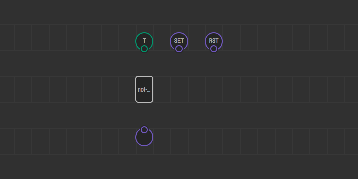
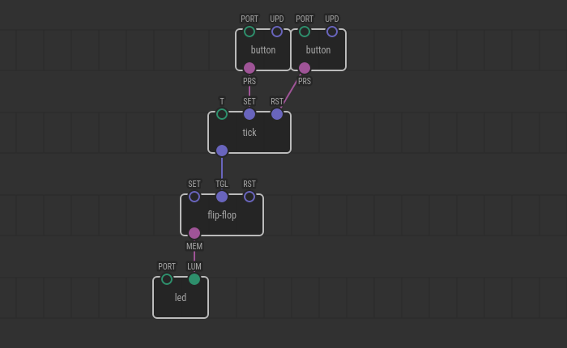

# Dealing with Time in C++

Many nodes respond to input changes immediately, but some nodes control
processes lasting for long time spans. They force themselves to be re-evaluated
after some delay to repeat a task or complete the job.

[XOD C\++ node API](/docs/reference/node-cpp-api/) provides scheduling functions
to deal with these cases. In this article, we’ll learn them by example.

## The task

We’re a going to implement a `tick` node which when triggered by `SET` pin
starts sending pulses at equal time intervals `T`. A user should be able to
cancel the series in progress by sending a pulse on `RST` input.

Although you could trivially express such node with a combination of
[`flip-flop`](/libs/xod/core/flip-flop/) and [`clock`](/libs/xod/core/clock/)
without touching C\++ at all, let’s ignore it for now.

## Prepare the node

As always, when you [make a C\++ node](../nodes-for-xod-in-cpp), start with a
new patch, add required terminals, and the `not-implemented-in-xod` node.



Don’t forget to provide a resonable default value for `T`. 1 second is fine.

Double-click on `not-implemented-in-xod` node to open the code editor.

## Set timeout

First, we should handle pulses on `SET` input. When set, we’ll use
[`setTimeout`](/docs/reference/node-cpp-api/#setTimeout) function to ask XOD
engine to call `evaluate` again after given timeout:

```cpp
struct State { };

\{{ GENERATED_CODE }}

void evaluate(Context ctx) {
    if (isInputDirty<input_SET>(ctx)) {
        // Get T-input value. Conventionally it should be expressed in seconds
        Number t = getValue<input_T>(ctx);

        // However, XOD API works with millisecond values, so convert
        TimeMs milliseconds = t * 1000;

        // Schedule re-evaluation after calculated number of milliseconds
        setTimeout(ctx, milliseconds);
    }
}
```

## Handle timeout

Good. We scheduled ourselves. Now we need to react. Use
[`isTimedOut`](/docs/reference/node-cpp-api/#isTimedOut) function for this. We
need an explicit check of whether the current evaluation caused by the timeout
because the reasons for `evaluate` calls differ. It could be an input value
update before the time interval elapsed.

```cpp
struct State { };

\{{ GENERATED_CODE }}

// Note, we extracted a function to read `T` input and set timeout
// with that value. The function helps us to avoid code duplication
// in `evaluate` since we need the code twice.
void charge(Context ctx) {
    Number t = getValue<input_T>(ctx);
    TimeMs milliseconds = t * 1000;
    setTimeout(ctx, milliseconds);
}

void evaluate(Context ctx) {
    if (isInputDirty<input_SET>(ctx)) {
        charge(ctx);
    }

    if (isTimedOut(ctx)) {
        // Timeout has been elapsed, emit an output pulse
        emitValue<output_OUT>(ctx, true);
        // To be re-evaluated next time we need to set timeout again
        charge(ctx);
    }
}
```

## Cancel timeout

The only thing left to be done is reset handling. When a pulse is sent to `RST`
we’ll use [`clearTimeout`](/docs/reference/node-cpp-api/#clearTimeout) function
to stop counting.

```cpp
struct State { };

\{{ GENERATED_CODE }}

void charge(Context ctx) {
    Number t = getValue<input_T>(ctx);
    TimeMs milliseconds = t * 1000;
    setTimeout(ctx, milliseconds);
}

void evaluate(Context ctx) {
    if (isInputDirty<input_RST>(ctx)) {
        // When pulsed on `RST` we cancel the timeout countdown regardless
        // whether it was set or not
        clearTimeout(ctx);
        // Return from `evaluate` early giving priority to `RST` so that
        // pulse on `SET` and timeout will not be even checked at this
        // evaluation pass
        return;
    }

    if (isInputDirty<input_SET>(ctx)) {
        charge(ctx);
    }

    if (isTimedOut(ctx)) {
        emitValue<output_OUT>(ctx, true);
        charge(ctx);
    }
}
```

## Test

That’s all. Our node is ready. Test it with two buttons connected to `SET` and
`RST` and a flip-flop with LED on another side



## Conclusion

XOD provides quite a basic API to manage time. Although it is simple, you get
all tools you need to control lengthy processes. Main principles are:

* Use `setTimeout` to schedule re-evaluation of self. Remember, the timeout is
  expressed in milliseconds.
* Always use `isTimedOut` to be sure you’re evaluating because the time has
  passed.
* If you want to run a task periodically, call `setTimeout` again manually when
  `isTimedOut`.
* Use `clearTimeout` to ensure no timeout countdown is in progress.
