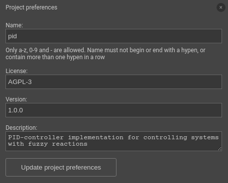
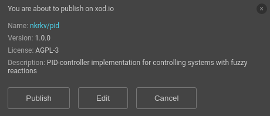

# Создание библиотеки

Эта статья поможет вам в процессе создания и публикации вашей
собственной библиотеки.

## Запуск библиотеки

Вот небольшой секрет: библиотеки и  [Проекты](../projects/) в XOD
не имеют технической разницы. Различия условны. Ваш проект станет
библиотекой, если вы так решите.

Чтобы запустить новую библиотеку, нажмите “File → New Project.”

## Создание нода

[Создание ноды](/docs/guides/#making-own-nodes) как библиотеки для любого проекта.

[Документация нода](../documenting-nodes/) информация о работе 
библиотеки. Отсутствие коротких описаний для нода и
их пинов, скорее всего, разрушит все ваши усилия и сделает
вашу библиотеку непригодной для использования другими.

## Добавление патчей с примерами

Очевидным шагом является тестирование ваших нода в действии перед
их совместным использованием. Один из возможных способов сделать 
это - создать несколько примеров _example patches_ . 
Это стандартные патчи с шаблономи `-example` суффикс в их имени
`mcp3002-adc-example`.

На таком патче поместите тестируемый нода и используйте самые 
базовые функции ввода / вывода: часы, константы, 
светодиоды, кнопки. Сделав это, вы фокусируетесь на тесте нода. 
Загрузите патч, чтобы убедиться, что нода работает как и ожидалось. 
Позже любой желающий сможет просматривать и загружать примеры,
и узнать, как работает нода.

## Установка метаданных

Чтобы опубликовать библиотеку, вам необходимо заполнить несколько 
полей уровней проекта. Все из них доступны через 
“Edit → Project Preferences” .

<table class="ui definition table">
  <tbody>
    <tr>
      <td>Имя</td>
      <td>
        Библиотека будет доступна для всех по пути:
         <code> имя_пользователя / имя </code>. 
		 Используйте лаконичное и точное имя, 
		 не более 20 символов.
      </td>
    </tr>
    <tr>
      <td>Лицензия</td>
      <td>
		Название лицензии OSS, определяющее условия использования 
		вашей работы. Выбери между  MIT, BSD, GPL, и т.д.
      </td>
    </tr>
    <tr>
      <td>Версия</td>
      <td>
		 Тег <a href="https://semver.org/" target="_blank"> semver </a> 
		 для предстоящей публикации. Если вы собираетесь опубликовать 
		 библиотеку впервые, как правило, начинайте с 
		 <code> 1.0.0 </ code>.
      </td>
    </tr>
    <tr>
      <td>Описание</td>
      <td>
        Пару предложений с описанием вашей библиотеки. 
		Смотрите на  
		<a
        href="https://xod.io/libs/">https://xod.io/libs/</a> и внутри XOD
        IDE.
      </td>
    </tr>
  </tbody>
</table>

## Публикациия

Когда всё готово, нажмите “File → Publish Library.” 
Просмотрите предлагаемое окно с описанием и нажмите

Через несколько секунд ваша новая библиотека будет доступна на
[Libraries] (/libs/) на сайте XOD. Не стесняйтесь сообщить
об этом [сообществу XOD] (https://forum.xod.io).

## Использование собственной библиотеки

Чтобы использовать библиотеку, которую вы уже опубликовали, в любом 
другом проекте, загрузите её, как любую другую библиотеку. 
То есть “File → Add Library” и [install](../using-libraries/#installing-a-library).

## Обновление библиотеки

Если вы опубликовали довольно сложную библиотеку, 
то вы, скорее всего, захотите рано или поздно выпустить 
обновление для неё. Для этого:

1. Откройте проект библиотеки.
2. Внесите необходимые изменения.
3. Обновите метаданные.
4. Опубликуйте снова.

Особое примечание об обновлении поля версии: 
вам не позволит повторно публиковать ту же версию, что и ранее. 
Номер версии должен быть уникальным. 
Лучшая практика - следовать [semver](https://semver.org/) следующим условиям:

* увеличивайте последнее число (1.3.1 → 1.3.2), если вы просто 
исправляете ошибки или дополняете описания;
* увеличивайте среднее число (1.3.1 → 1.4.0), если вы выпускаете 
новые функции, сохраняя обратную совместимость - т.е. вы добавляете
новые функции, а не меняете существующие;
* увеличивайте первое число (1.3.1 → 2.0.0), если вы вносите 
изменения.

После публикации новой версии, чтобы сделать ее видимой для ваших 
других проектов, обновите локальную установку собственной 
библиотеки, нажав “File → Add Library” снова.
