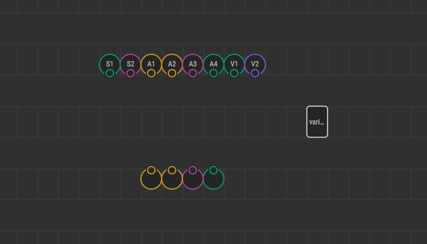
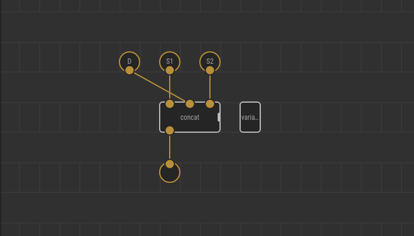

# Creating Variadic Patch Nodes

Declaring your patch node to be variadic allows its user to add or remove
similar input pins dynamically. For you, it is a way to avoid creating a list
of mechanical variations to support the various number of inputs like:

* `foobar`
* `foobar-2`
* `foobar-3`
* …
* `foobar-8`

Make sure you’re familiar with the [variadic nodes](../variadics/) concept
and understand how the expansion process works.

## Markers

To make your patch node variadic, you should place a special marker node on it.
Find the marker node under the `xod/patch-nodes` library. You need
`variadic-1`, `variadic-2`, or `variadic-3`. The number defines the arity step,
that is the group size by which the rightmost input pins replicate.

The `variadic-*` node itself does nothing and is stripped out during
compilation. It exists solely to define indefinite arity support.

## Pin assignments

Whenever you place a variadic node marker, the input pins get roles depending
on their position relative to each other. Consider a patch node draft with a
`variadic-2` marker:

To make the expansion XOD split pins of a variadic patch node into three
groups.

**Variadic pins** (aka value pins). The rightmost pins get this role. Their
number equals to the arity step. In the example above they are `V1` and
`V2`. Values for the inputs on each level are provided by a node user.

**Accumulator pins**. Pins in the middle get this role. Their number equals the
output number. In the example they are `A1`, `A2`, and `A3`. The user provides
values only for the top level of the cascade; all other levels get accumulator
values straightly from output pins of the respective upstream node.

**Shared pins**. The leftmost pins which are not variadic nor accumulator get
this role. In the example they are `S1` and `S2`. The values are provided by
the user, and they are delivered to each level in the cascade as is. In many
cases there will be no shared pins.

Finally, consider a string join node example. We want a node which takes an
arbitrary number (two or more) of input strings and joins them together
inserting a delimiter between each. For example, it joins `"foo"`, `"bar"`,
`"baz"` with delimiter `"; "` into `"foo; bar; baz"`. The delimiter is shared
between all levels of expansion, so its input terminal goes left. We want the
arity to increment one by one, so we use the `variadic-1` marker. Finally, a
possible patch node implementation may look like this:

## Rules

To let XOD properly expand your variadic node when transpiling you must satisfy
several natural restrictions:

1. There should be no more than a single `variadic-*` marker.
2. A variadic patch node should have at least one output.
3. The total number of inputs should be equal or greater than the number of
   outputs plus the arity step.
4. The types of accumulator inputs must strictly match the types of the outputs
   even if an implicit cast is allowed in other cases.

On the patch board, the variadic marker nodes either render usually or in red
color. The later case tells you’re breaking some rules.

Hover the node to see the error. You have to resolve all issues or remove the
marker node to make the program compile successfully.
