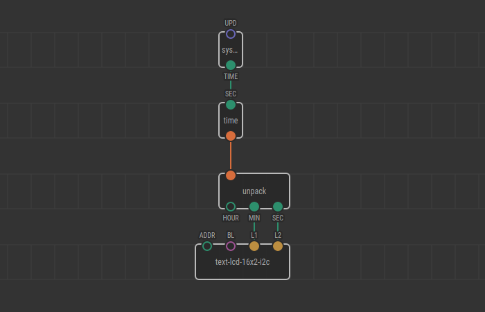
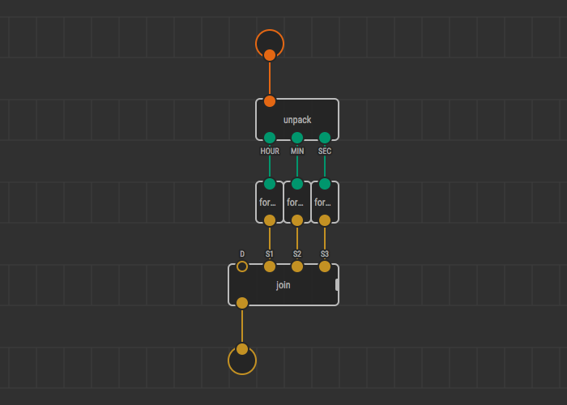
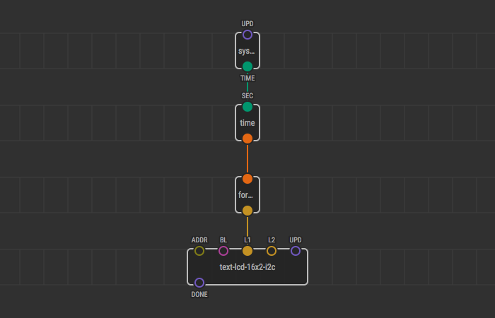
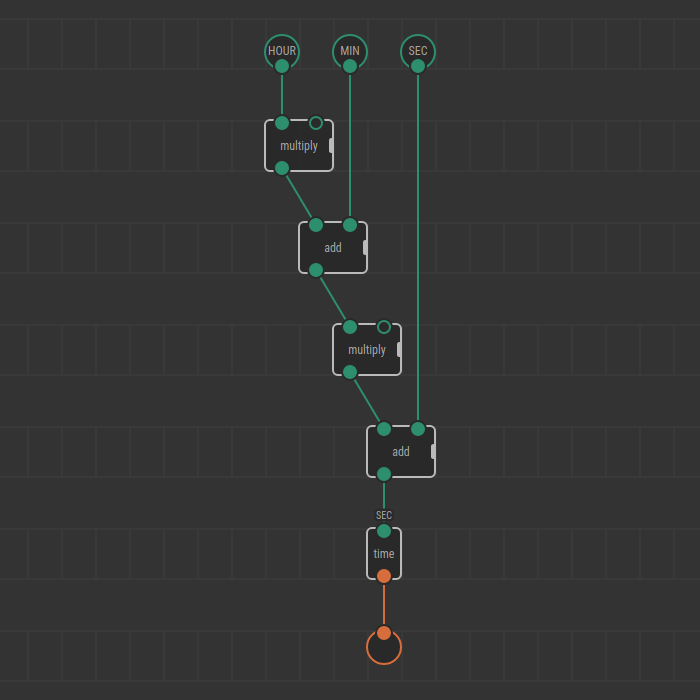

# Defining Custom Types

XOD has plenty of [built-in types](../data-types/): numbers, booleans, strings,
and so on. They are enough to solve most of the tasks. However, there are times
when a new type is much desired to express a concept that is not in the system.

That’s when _custom_ types come into play. Let’s learn them by example. Suppose
we want to define a new type to store time values. Time, in this case, is a
value you think of when watching at a clock: “10:54:23”, for example.

We are going to make nodes for time creation and string formatting. Start by
creating a new project.

## Marker `output-self`

In XOD custom types, as everything, are made out of patches. In
`xod/patch-nodes` you’ll find an `output-self` marker node which acts like a
regular output terminal, but rather than provide a value of a particular existing
type, it _defines a new type_ with the name of that patch. Such patch then is
called a _constructor_ of the type.

We’ll define a new type `time`. To do so, create a new patch `time` and place an
`output-self` node on it.

Next, we should decide how the new type is represented internally in C++. All
constructor patches should be implemented in C++.

In our case, one way to store the value is keeping the number of seconds past
since the beginning of the day. That is:

- `0` corresponds to `00:00:00`
- `1` → `00:00:01`
- `59` → `00:00:59`
- `60` → `00:01:00`
- `3599` → `00:59:59`
- `3600` → `01:00:00`
- and so on

We need to accept the number of seconds as a parameter of the constructor. Thus,
we add an `input-number` node. And to provide the C++ implementation, we add the
`not-implemented-in-xod`. Finally, our patch looks like:


Now, let’s write down the code. Follow the comments to understand essential
parts:

```cpp
// When defining a custom type you must declare a C++ type with name `Type`.
// It will be used by the system to store and pass values of the new custom
// type in C++ land.
// In our case the Type is a simple alias for a single number. However, you
// might use a complex struct or class for this role.
using Type = Number;

struct State { };

\{{ GENERATED_CODE }}

void evaluate(Context ctx) {
    auto sec = getValue<input_SEC>(ctx);
    auto secsInDay = 24 * 60 * 60;

    // Use the `Type` type to define a new variable that will be
    // later output as the result. We use `fmod` to perform day-wrap
    // and be sure the value is in valid range
    Type out = fmod(sec, secsInDay);

    // Then we can output the new type value like a regular one
    emitValue<output_OUT>(ctx, out);
}
```

At this point, we have a fully functional new type `time`, which one can
construct using the `time` node. But we can’t do anything with it yet. Let’s
improve it.

## Inputs in C++

Let’s implement a node to split the time value into hours, minutes, and seconds.
We’ll call it `unpack`. It should take a time value as an input and output the
three values.

As you might notice, at the moment you place an `output-self` node on a
constructor patch two new terminal nodes are automatically generated next to the
constructor patch. In our example, they are `input-time` and `output-time`.

We use an `input-time` and three `output-number` to build the interface of our
`unpack` patch:


Now, the C++ part. Follow the comments:

```cpp
struct State { };

\{{ GENERATED_CODE }}

void evaluate(Context ctx) {
    // We use `auto` C++ keyword because the `Type` we defined earlier is in
    // another namespace. The `auto` type instructs the C++ compiler to infer
    // the actual type from a right-hand side expression and it will always
    // match the custom type, be it an alias, struct, or class.
    auto t = getValue<input_IN>(ctx);

    // Now we can use the fetched value as usual. Perform some truncations
    // and modulo divisions to convert seconds to hours, minutes, and seconds
    emitValue<output_SEC>(ctx, fmod(t, 60));
    emitValue<output_MIN>(ctx, fmod(trunc(t / 60), 60));
    emitValue<output_HOUR>(ctx, trunc(t / 3600));
}
```

Good. Now we have a way to construct and “destruct” time values. See it in
action by using the standard `system-time` as a source of seconds and an LCD as
a display:



You’ll see the first line displaying minutes (0, 1, 2, etc) and the second line
showing the seconds including fraction. Note how the seconds wrap at 60.

## Inputs in patch nodes

Now let’s make a patch node without touching C++ which takes a time value and
outputs a string in ISO format: “01:33:59.” We’ll use `unpack` created in the
previous section as an adaptor between the custom type and the types for which
we have other nodes to process them.

A small utility node `format-two-digits` will be very handy here. It takes a
number and outputs a two-digit string enforcing leading zero for values
below 10. Without diving into details much, here’s its code:

```cpp
struct State {
    char buff[3];
    CStringView view;

    State() : view(buff) {}
};

\{{ GENERATED_CODE }}

void evaluate(Context ctx) {
    auto state = getState(ctx);
    auto n = getValue<input_IN>(ctx);

    // convert to an integer in range 0-99
    uint8_t ndec =
        (n < 0) ? 0 :
        (n > 99) ? 99 :
        (uint8_t)n;

    // convert to characters, leave the last
    // char intact as it always \x00
    state->buff[0] = '0' + ndec / 10;
    state->buff[1] = '0' + ndec % 10;

    emitValue<output_OUT>(ctx, XString(&state->view));
}
```

Given the `unpack` and `format-two-digits`, creating the desired `format-iso`
becomes very straightforward:



To test the new node use `system-time` and an LCD:



You’ll see the display starting by “00:00:00,” then “00:00:01,”… “00:00:59,”
“00:01:00.”

Using the same technique, you can implement other nodes which take time values:

- 12-hour formatter
- equality / less / greater comparators

## Outputs in patch nodes

We have the constructor node `time`. What if we want to provide alternative
constructors or other nodes with `time` output? That’s simple. Use a combination
of an original constructor node and `output-time` on a new patch.

For example, let’s make an alternative constructor `pack` which works as an
opposite to `unpack`. It should take hours, minutes, and seconds; and return
`time`. The general idea is to transform the input values into a form acceptable
for the constructor and send its output directly to the `output-time` terminal:



## Outputs in C++

As an alternative to the previous implementation, let’s do the same to
demonstrate how the custom type can be accessed from C++ when it’s only used as
an output and thus the `auto` C++ keyword cannot be used to define a variable
type:

```cpp
struct State { };

\{{ GENERATED_CODE }}

void evaluate(Context ctx) {
    auto h = getValue<input_HOUR>(ctx);
    auto m = getValue<input_MIN>(ctx);
    auto s = getValue<input_SEC>(ctx);

    // Use ValueType<...>::T metaprogramming construct to access the type of
    // an input if its symbol is hardly accessible in other ways. In our case
    // `ValueType<output_OUT>::T` refers to the `Type` we defined in the
    // constructor.
    ValueType<output_OUT>::T result = h * 3600 + m * 60 + s;

    emitValue<output_OUT>(ctx, result);
}
```

---

Now you’ve learned how to introduce custom types. Use them wisely to create new
powerful abstractions. Think about more complicated applications to get even
more power from custom types:

- Use own `struct` as `Type` to hold composite data
- Use a pointer to a C++ object as `Type` to provide wrappers around C++ classes
- Build custom types based on other custom types
- Combine custom types with [generics](../generics/) to build unified interfaces
  to different objects
