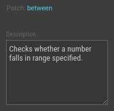
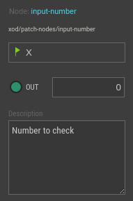
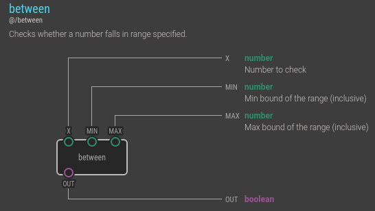
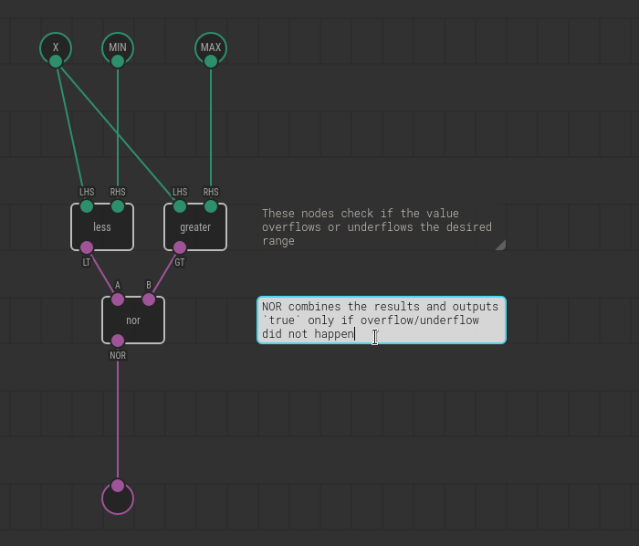

# Documenting Nodes

Unless you make a throwaway node, adding a short description for it is a good
idea. Documentation helps you to recall what the node does and how it behaves in
edge cases. If you’re going to publish your nodes as a library, documentation is
the must.

Fortunately, describing a node and its pins is a simple process. Writing down a
text of couple tweets in length would make your node order of magnitude better
than undocumented one.

Let’s document the node `between` you’ve created while following
[Creating nodes for XOD in XOD guide](../nodes-for-xod-in-xod/).

## Describe the patch

First, we need to describe our `between` patch as a whole. Open the patch,
select nothing. In the Inspector you’ll see the “Description” field. Put a short
description there.

## Describe pins

Then, we’ll put a short line of description to pins. Select a terminal node for
the pin you’re going to document and add a description with Inspector as you did
for the patch.

## Preview the doc

Select the `between` node in the Project Browser and press `H` key to invoke
node’s help. This is how the help you just created will look like when others
explore what your node does. Nice, isn’t it?

Note
Note, we’ve omitted a description for the <tt>OUT</tt> pin as its purpose is
quite obvious. Try to keep a balance between laconic brevity and details to
make your nodes pleasant to work with.

## Add patch comments

Another annotation tool available in XOD is patch comments. They help to
understand what’s going on on a patch if one opens it for view or edit.

You can add a comment by hitting “Edit → Insert Comment.” Then drag, resize the
comment to the desired position. Double-click to edit its content. When done
Ctrl+Enter or click outside the comment to commit.

## Markdown

Use [Markdown](https://en.wikipedia.org/wiki/Markdown) formatting if plain text
is not enough. In particular:

* \*stars\* to *emphasize*
* \`backticks\` to refer to `pin`, `node`, `file` names
* Blank line to start a new paragraph
* Start a line with “\* ” for bullet list items
* Start a line with “1. ” for ordered list items

Note
Although Markdown not supported on every medium your documentation is shown
yet, we work on it. Eventually all the docs will render with Markdown
formatting.

