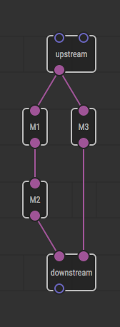

Execution Model in Details
===========================

In contrast to conventional programming, XOD is a data flow language rather
than control flow one. That means there is no such thing as an instruction
pointer that determines what command will be executed next moment. Instead,
updates are done in semi-instant *transactions* where all data is evaluated
simultaneously.

Functional and effect nodes
---------------------------

There is such thing as a *function* in mathematics. Sure, you know many of them:

- `f(x) = sin x` is a function of single argument that returns its sine;
- `f(r) = π × r²` is a function of single argument that returns square of a
  circle with given radius;
- `f(x, y) = √(x² + y²)` is a function of two arguments that returns a distance
  from origin to a point with given coordinates;
- `f(v₀, a, t) = v₀ × t + (a × t²) / 2` is a function of
  three arguments that returns velocity of an object at a particular moment in
  time.

Functions are great because they have very predictable behavior. E.g. if you’re
computing circle square it will be always the same for the same radius. It is a
nonsense if the result of computation today would differ from the result of
yesterday, or if the result would change depending on other factors like
weather outside. Furthermore computing circle square of radius 2 can’t affect
a result of another computation, e.g. `sin 2` now or in the future.

Functions are intuitive and understandable pieces that don’t involve side
effects in computation.

Note
Experienced programmers say that such functions are referrentially transparent,
easy to reason about, stateless, idempotent and pure. They mean the same things
and they love’em.

The characteristics of functions make them ideal building blocks to compose
complex computations. Input arguments of one function could be results of
other functions. They in turn can get arguments from yet other functions, etc.

However, if you’re going to build a program solely from functions it would be a
program that always do the same thing and lead to absolutely same result.  It
would not depend on user input, events in real world, or time. It would not
affect outside world and furthermore would have no chance to present
computation results. All because functions can’t have side effects. Thus
another kind of building block is required.

In XOD there are two kinds of nodes available. *Functional nodes* represent
functions. And *effect nodes* serve as interfaces to the outside world, time,
and memory of past values.

### Functional nodes

Functional nodes always have inputs and output pins. All pins have [value
types](../data-types/#value). In other words functional nodes *never* have pins
of [pulse type](../data-types/#pulse).

Output values depend only on values of input pins. They can’t depend on time
(only if given as an explicit input value), on parameters of outside world, or
on results of their past computations. Given the same set of input values they
always result in the same set of output values.

Some examples of functional nodes are:

* [`add`](/libs/xod/core/add/)
* [`if-else`](/libs/xod/core/if-else/)
* [`less`](/libs/xod/core/less/)
* [`or`](/libs/xod/core/or/)
* [`format-number`](/libs/xod/core/format-number/)

Functional nodes affect nothing but their output values. They can’t change
brightness of a LED or speed of a motor on their own.

Note
If you’re an advanced Excel user think about functional nodes as of cell
formulas.

### Effect nodes

Effect nodes could have just inputs, just outputs or both at once. They
*always* have pins of pulse type. Input pulses is what drives them to perform
effects and their output pulses is what tell us about effects that took place.

A result of hitting an effect node can be arbitrary. It could turn on a lamp,
send an SMS, launch a nuke, or memoize a value for future use.

When such node would emit an output pulse is up to node implementation as well.
It could pulse on an update from sensor, on SMS received or on timeout event,
for example.

Some examples of effect nodes are:

* [`clock`](/libs/xod/core/clock/)
* [`delay`](/libs/xod/core/delay/)
* [`buffer`](/libs/xod/core/buffer/)
* [`analog-input`](/libs/xod/core/analog-input/)
* [`pwm-output`](/libs/xod/core/pwm-output/)

Effect nodes is a thing that complements functional land so that your program
could interact with a user, the world, and the time.

Program life cycle
------------------

In any particular moment a XOD program is either in a transaction or in an idle
state.

While being idle the system stays stable, nothing changes. A board can even
choose to go sleep to keep battery charge longer. What makes the program go out
of idle state is getting a new pulse from an effect node.  It could be a pulse
from system clock or a sensor, for example.

A pulse cause the program to enter a new *transaction*. The pulse flows along
links downstream and cause nodes it hits to update. Node update process is
called *evaluation* in XOD.

At the moment of pulse emission a node can (and in most cases it would) set new
values on its other ouput pins that have value types such as number or boolean.

Evaluation of a node hit by a pulse in most cases would require computing
actual values on other node’s input pins. That values could depend on values of
upstream nodes’ outputs, which in turn depend on values of their upstream
nodes, and so on. All these dependencies are resolved by the XOD runtime
engine. Final and intermediate values required to evaluate a node are computed
atomically in the transaction.

After all nodes affected by a pulse are evaluated the transaction completes and
the system returns to the idle state.

Transaction rules
-----------------

### No external pulses while a transaction is in progress

Any transaction has a guard that will not allow any external pulse to come half
way along the current transaction is in progress. Such pulse will be postponed
and would trigger a new transaction after the current one completes.

To be more precise, external pulses are pushed into a FIFO queue. And once the
system is in the idle state a pulse is popped from the queue and a new
transaction is initiated. The transaction completes, the system goes idle,
takes next pulse from the queue, launches new transaction, and so on until the
queue is empty.

### Evaluation order

During a transaction any particular node will be evaluated only after all nodes
it depends on via links would be evaluated in their turn.

Consider following example.

The result node will be only evaluated after both branches are evaluated despite
they have node chains of different length. You can’t know the order the branches
will be evaluated. It could be M1-M2-M3, M3-M1-M2, M1-M3-M2, or even M1-M2 and
M3 in parallel. Furthermore, result node evaluation could be postponed until
its values would be actually required (so called “lazy evaluation”). It’s up to
target platform to decide.

The only thing that does matter is a node will be never evaluated with incomplete
data.

That is the reason why inputs can’t have more than one incoming link. In other
case the ambiguity will take place when two or more links would try to deliver
different values.

### Buffering

Effect nodes’ outputs are *buffered* when changed. In other words the outputs
keep most recent value they got. The data is persistent between transactions. So
a node will “see” the buffered value from an old transaction via link if it is
required to evaluate again due to other input value change.

Pro Tip
If you’re familiar with conventional programming think of pins and their
buffered values as <em>variables</em>. They hold the program state and evolve over the
time.

Whether values on of functional nodes’ pins would be buffered is up to target
platform to decide. Since outputs of a functional node depend only on its
inputs the decision is just a matter of execution speed vs RAM consumption. It
has no effect on actual program behavior.

### Feedback loops handling

In XOD link cycles that contain only functional nodes are not allowed. They
would lead to dead locks and program hangs.

However it is OK to have a cycle broken by an effect node. In that case
new value will be delivered via feedback link but the node will “see” it
only once it would receive new incoming pulse.

Summary
-------

Program life cycle can be looked at as a infinite series of transactions that
run whenever an external impact occurs. Pulses drive the program. No pulses, no
changes.

Transactions are protected from sudden pulses that could change or make it
ambiguous the order of nodes’ evaluation.
