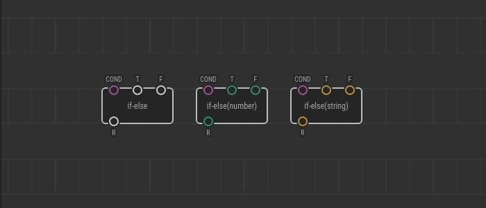
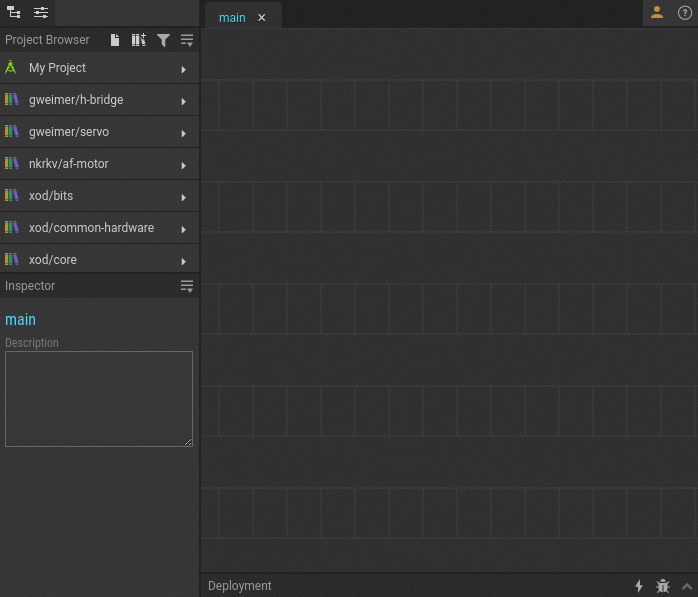
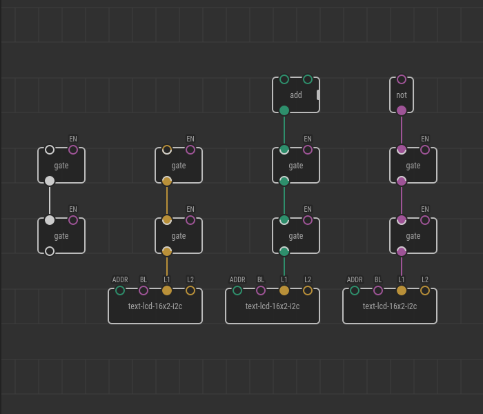

# Generic Nodes

Sometimes logic behind a node does not depend on actual types of input values
provided. Take, for example, the
[`if-else`](https://xod.io/libs/xod/core/if-else/) node:

It takes a boolean condition `COND` and outputs either `T` or `F` value to `R`
depending on the condition. It should not matter what the actual types of `T`,
`F`, and `R` are. The only important thing is that they should be the same: all
numbers or all strings, for example.

The generic nodes mechanism helps to support such polymorphic nodes.

## Dealing with generics

You can understand that a node is generic by looking at its pin colors. The
generic pins on such node are grey. If you open a helpbox for such node, you’ll
see the pins have types like `t1`, `t2`, or `t3` rather than concrete `number`
or `string`.

If an input pin has type `t1` that means it potentially can accept any data
type. Once you link or bind, for example, a number to it all other `t1` pins on
that node are considered to be numbers too. The same for `t2` and `t3`. Note,
the generic types `t1`, `t2`, and `t3` do not depend on each other. So `t1` may
be a number while `t2` is a string and so on.

Usually, you use generic nodes like regular ones and don’t think of logic behind
type deduction, and resolution process. Although to handle some edge-cases you
need to understand principles described below.

## Resolution process overview

Whenever you transpile a XOD program which contains generic nodes, the system
_resolves_ them to concrete _specializations_, so that a particular C++
implementation can be found in the final turn.

The system tries to replace in-place each generic node with another node called
a _specialization node_ which is chosen based on _deduced_ input types.

A generic node can be a composition of other generic nodes, or it can be
_abstract_. Abstract nodes can’t translate to C++ because they contain no
implementation and serve as placeholders for the transpiler (hence called
abstract). If XOD can’t find a required specialization for an abstract node, it
shows an error.

When dealing with a generic composite node, the system searches for a matching
specialization, and if not found, it expands the composition and reruns
resolution. The process repeats recursively until all specializations are found
or only unresolved abstract nodes left, which is an error.

Let’s elaborate on each of concepts mentioned.

## Specializations

A specialization is a regular patch having a distinctive name like:

* `if-else(number)`
* `if-else(string)`

The name is made up of the abstraction patch name (`if-else` in this case) and
type specialization for `t1` enclosed in parentheses.

If a generic node has two or more generic types, the types in parens should be
comma-separated, e.g., `foo(string,number,pulse)`.

In most cases, you should not bother on the specialization patches and nodes as
you’re interfacing with the base abstraction (`if-else`) and that’s enough. The
specializations don’t even appear in the quick-search suggester by default.

However, sometimes you will want to be specific and use a specialization
directly, like a regular node. That’s called _manual resolution_. To access a
particular specialization, use one of the following methods:

1. Find the specialization in the Project Browser and drag-n-drop it on your
   patch as you would do with any regular node.
2. Double-click your patch, type a part of the node name and add a left
   parenthesis to see the specializations (e.g., type `if-el(`).
3. Select a generic node to resolve manually, then in the inspector choose the
   desired specialization in the drop-down below the node name.

## Type deduction rules

To be successfully resolved later a generic node should match a specific type to
each of `t1`, `t2`, and `t3`. It is called _type deduction_.

The deduction is done based on actual types of links and values bound to the
generic pins. XOD will show an error if types can’t be deduced unambiguously,
for example when one pin of type `t1` pretend to be number and another `t1` pin
wants to be a string. In such cases you can place cast nodes like
[`format-number`](https://xod.io/libs/xod/core/format-number/) before the
inputs explicitly.

A slightly more complicated process takes place when multiple generic nodes link
in a chain with their generic pins. In such cases two subsequent passes of type
deduction are performed:

1. _weak_: a bottom-up pass in which generic inputs infer their types from
   corresponding outputs;
2. _strong_: a top-down pass while which generic outputs infer types from
   corresponding inputs.

The strong pass overrides any results produced by the weak pass.

In IDE you’ll see the deduction results in real time. The pins deduced are
zebra-colored with gray and the color which corresponds to the inferred type.

The weak resolution process exists only to deliver better developer experience
in IDE when you’re embedding generic nodes into your patches.

The final program is guided only by the results of the strong pass.

## Node resolution

On the last stage of transpilation, when abstract nodes have to be replaced with
particular specializations, the specializations are chosen based on the types
deduced previously.

All matches for `t1`, `t2`, and `t3` are known at this point, so the remaining
task is to find the proper specialization patch in the project. XOD looks for a
patch with name `<basename>(<t1>,<t2>,<t3>)` in the project and all libraries
installed locally. For example, if the system is about to resolve an abstract
`if-else` node with `t1` deduced to `number`, the following patches will be
found:

* `xod/core/if-else(number)`
* `bob/stuff/if-else(number)`

Now, if no specialization patches found XOD will show an error about unresolved
abstract node. You have to create the specialization by yourself or install a
library which includes proper specialization.

If two or more specializations were found, that’s an error too because the
system cannot choose one of them unambiguously. In that case, you have to
resolve the node manually using Inspector.

## Making generic patch nodes

The process of [creating own generic patches](../creating-generics/) is
documented in a separate article.
