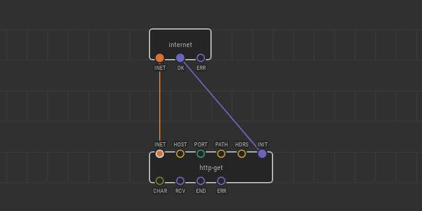
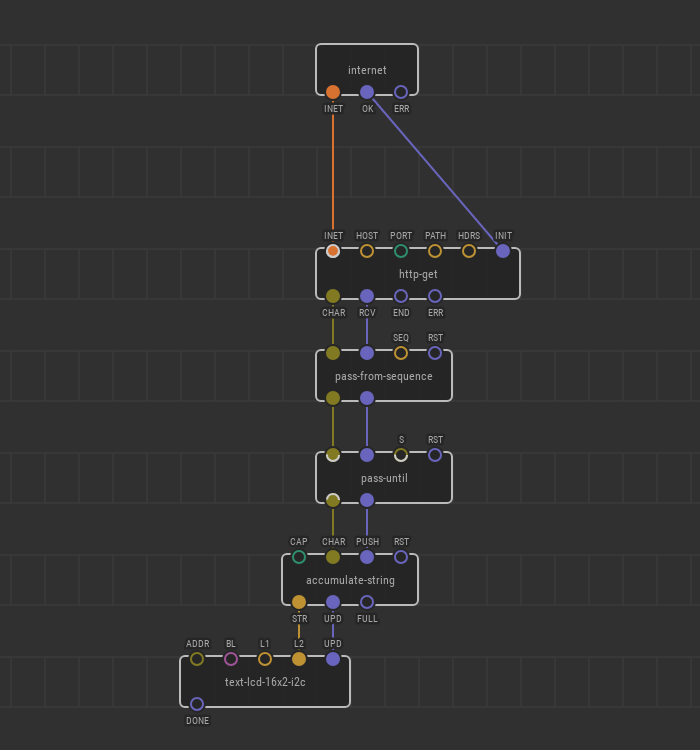

# Fetching Data from Web with HTTP GET requests

When you open a browser, enters an URL, and hit Enter your browser issues a
so-called HTTP GET request to a server pointed by the URL. The server reacts to
the response taking into account who sends it and with which parameters, then
responds back with data. In casual use, that data is often a plain text
formatted with special tags known as HTML:

```html
<html>
  <head>
    <title>I’m a title shown in tab</title>
  </head>
  <body>
    <h1>Hello, I’m a heading</h1>
    <p>I’m a paragraph that a user can read</p>
    <p>I’m the second paragraph</p>
    <p>A browser knows how to render me pretty</p>
  </body>
</html>
```

HTML is nice to present a page intended for consumption by a human reader, but
it’s not the only variant how the server can reply. There are many possible
response formats, and some of them are intended to be consumed by a machine, not
a human. JSON is a simple and popular format to be consumed by devices. Try to
open the following URL: http://api.xod.io/httpbin/ip

The server responds back with an IP address of a requester (you) as it seemed
from the outside world.

```json
{"origin":"185.36.157.186"}
```

The response is not so aesthetically pleasing, but it would be easy for a
machine to parse it and do something useful.

XOD provides nodes to make HTTP requests and parse responses. As an example,
let’s make a XOD program that requests an external IP address and shows it on an
LCD.

We need an established internet connection for the device to go on. How to make
it depends on the module you use as the internet provider. Refer to
[Connecting W5500](../w5500-connection/) for an example of connecting an
Ethernet Shield board.

From now on, we expect you’ve created a node named `internet` encapsulating your
internet connection.

## Sending request

The first thing to do is sending the request. The process involves opening a TCP
connection to the internet server and writing request bytes in a proper format
defined by the HTTP protocol. These details are encapsulated inside the
[`xod/net/http-get`](https://xod.io/libs/xod/net/http-get) node, so it is enough
to specify only basic details of the request.



The `INET` input pin should be linked to the node providing an established
internet connection. The `INIT` input pulse starts a new request/response
session. The rest of the inputs specify a URL and request payload.

To understand which input means what, let’s look at parts of an URL:

<table class="ui very basic collapsing table">
  <thead>
    <tr>
      <th><div class="ui teal label">1</div></th>
      <th></th>
      <th><div class="ui teal label">2</div></th>
      <th><div class="ui teal label">3</div></th>
    </tr>
  </thead>
  <tbody>
    <tr>
      <td>http</td>
      <td>://</td>
      <td>example.com:8080</td>
      <td>/foo/bar?baz=42&qux=hello</td>
    </tr>
  </tbody>
</table>

1.  The part before `://` defines a _scheme_. For the HTTP protocol it is either
    `http` or `https`. The latter is secure HTTP protecting you from an evil
    traffic interception or injection. Note, that HTTPS relies on heavy
    cryptographic algorithms which might be unsupported by your hardware.
2.  The next part is called _host_ which is a server domain name and the
    destination port split by a colon. A web server may listen on many ports
    with completely different sites and services on each of them, but
    conventionally HTTP servers prefer port 80 whereas HTTPS prefer 443. If the
    port matches the default, the port part can be omitted: `http://example.com`
    and `http://example.com:80` are the same thing.
3.  The tail starting with a forward slash is called _path_. A few decades ago
    it was used as a file path to be returned by the server. But now in most
    cases, it is an arbitrary string which points to a _virtual_ resource known
    as _endpoint_ to be returned. The convention of using slashes to structure
    the path was preserved though. At sometimes you’ll see an extra key-value
    component after a `?`. It’s known as query arguments, but nevertheless, it
    is just another part of the path.

We are going to make a request to http://api.xod.io/httpbin/ip and now you are
ready to fill in the address details:

- `HOST` = `"api.xod.io"`
- `PORT` = `80`
- `PATH` = `"/httpbin/ip"`

One more input to note is `HDRS` which defines so-called HTTP headers which are
sent along with the request. The headers can tell a server to adjust its
response to be more efficient or easy to consume by a client. Headers are also
used for authentication purposes. For our example they are not necessary, so
leave the input blank.

Now, if you upload the program to a board, it will make a single HTTP request to
the server, the server will see it and reply. Currently, we’re ignoring the
response. Let’s fix it and make something useful with the incoming data.

## Parsing response

The `http-get` node has several output pins through which it pushes the response
character by character and then notifies that the response is completed.

Powerful computers usually read an HTTP response entirely into memory and then
pass the buffer to a processing function. However, that’s not always possible
for microcontrollers having a few kilobytes of RAM. To be efficient in terms of
consumed memory we are going to use a stream parsing technique when the incoming
data is processed on the fly as it goes in.

Take a look at a sample response again:

```json
{"origin":"185.36.157.186"}
```

We are interested in the “185.36.157.186” part. The rest can be safely ignored.
Our plan is:

- Skip all characters until a sequence `"origin":"` is found
- Accumulate all characters until another `"` is found
- Use the accumulated string as the result

You can find nodes for the basic streaming processing in the
[`xod/stream`](https://xod.io/libs/xod/stream/) library. We will use
`pass-from-sequence`, `accumulate-string`, and `pass-until`.

Putting all things together, here is the patch to print the external IP address
of your IoT device on an LCD:



---

Although the result might seem not very expressive, it demonstrates one full
cycle of interaction with a server located on the internet. To request some
exciting data you need to find a public web-service with an HTTP API endpoint
providing the values you are looking for. The principle of the communication
will be the same for any other server.

In cases when your device should _affect_ the outside world, it is often
required to use HTTP POST requests instead of HTTP GET. In these applications
use [`xod/net/http-post`](https://xod.io/libs/xod/net/http-post/) instead of
`http-get` which slightly adjusts the data sent over the network. The rest of
the details is the same as shown in this article.
