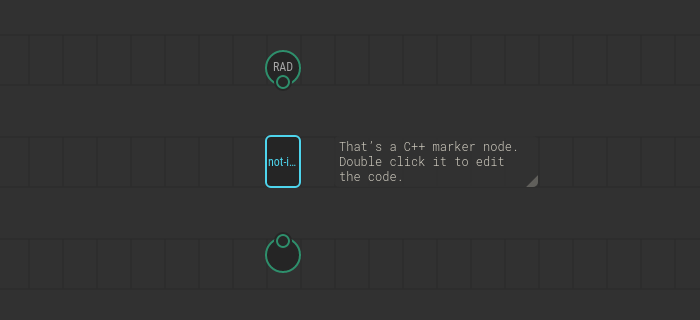
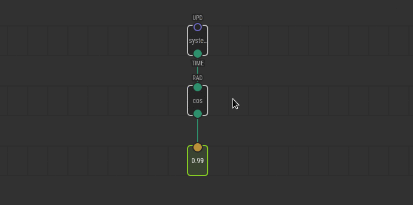

# Creating Nodes for XOD in C++

When you need a new node that cannot be easily expressed as a
[patch node](../nodes-for-xod-in-xod), you may implement it in C\++. Another case
to choose C\++ is when performance matters much.

The process outline is:

1. Create a new patch.
2. Place input/output terminals the same way you do when making patch nodes.
3. Add a `xod/patch-nodes/not-implemented-in-xod` marker node.
4. Double click the marker and write down C\++ code.

## The task

Imagine there is no `cos` node to compute an angle cosine in XOD yet. Let’s make
one.

To thoroughly understand the example it is expected you’re familiar with the
process of creation regular [patch nodes](../nodes-for-xod-in-xod).

## Prepare a dummy

Start with a clear project or open a project with your utilities. Create a new
patch (Ctrl+N) and name it `cos`. That’s the name the new node will get.

Now, we need to create input and output terminals. The cosine function takes one
argument (angle) and returns a single result. So we need an `input-number` and
`output-number`.

When node’s pins meaning is utterly apparent, we recommend omitting pin labels
to reduce visual clutter. In our case the meaning of output is obvious, but the
input is not so simple. The angle could be in radians or degrees. For this
example, we’re going to choose [radians](https://en.wikipedia.org/wiki/Radian)
because they are often more convenient in mathematical computations and they are
SI units. To make it clear, let’s give label `RAD` to the input terminal.


<div class="ui segment note">
<span class="ui ribbon label">Note</span>
Despite the recommendation, many standard XOD nodes include labels even in
trivial cases. It is legacy; we’ll fix them in future.
</div>

## Declare it’s a C\++ node

The next step is placing `not-implemented-in-xod` node from `xod/patch-nodes`.
It’s a dummy node that tells XOD: “Ignore all regular nodes on this patch, I
have a C\++ implementation, use it.”



Double click the `not-implemented-in-xod` node to drill-down. You’ll see an
embedded code editor with a template for a start.

## Write down the code

In most cases, when you implement a C\++ node you want to read values from
inputs, do something useful with them, and put some values into outputs. To
communicate with inputs and outputs, XOD provides C\++ functions `getValue` and
`emitValue`. They’re better demonstrated with an example of complete `cos`
implementation:

```cpp
// Ignore this for now. The definition is required by XOD but we
// not use it for cos
struct State { };

// This is an obligatory marker. XOD will put pin definitions there
\{{ GENERATED_CODE }}

// The `evaluate` function is the node’s entry point. It is the only
// function XOD requires to implement. The context parameter is a
// black-box object you’ll pass to various API functions.
void evaluate(Context ctx) {
    // `getValue` function reads a pin. In angle brackets, it takes a
    // name of the pin in form input_PINLABEL (input_RAD in our case)
    Number x = getValue<input_RAD>(ctx);

    // Next, we use regular C++ to perform some actions. Our case is trivial.
    // All we have to do is to call the standard C++ cos function.
    // Note the data type `Number`. It’s the type XOD uses to represent numbers
    // on the current platform.
    Number result = cos(x);

    // `emitValue` is like `getValue`, but it writes values rather than read.
    // Note we use `OUT` label to access our unlabeled output terminal.
    // `OUT` is the default name when you omit the label.
    emitValue<output_OUT>(ctx, result);
}
```

You may wonder why we used `output_OUT` to refer our unlabeled output terminal.
That’s a default name when you omit the label. Likewise, if you omit a label for
an input, use `input_IN` to refer to it. And if you have got several unnamed
terminals use `input_IN1`, `input_IN2`, `output_OUT1`, `output_OUT2`, etc. The
index assigned according to a terminal position counting from left to right.
Hover a pin label in the inspector window to get a tooltip with the identifier
if you’re in doubt.

You could think there’s quite much boilerplate code to wrap a simple call to
C\++ `cos` function. It’s because the implementation in our example is trivial.
When C\++ implementation does a bigger job, few calls to `getValue` in the
beginning and `emitValue` at the end is not a big deal.

## Use it, test it

Now, our `cos` node is ready. Let’s use it. Create a new patch `test-cos`. Use
[`system-time`](/libs/xod/core/system-time/) as an input and a `watch` node to
observe the result. Upload the patch with the debugger and see how the watched
value swings from 1 to -1.



Congratulations! You’ve done your first C\++ node.

## Document the node

When the node works as expected, it is a good idea to complete the task by
adding a description for the `cos` node and its pins. Describing C\++ nodes
doesn’t differ anyhow from [documenting any other node](../documenting-nodes/):

* Select nothing and put patch description in the Inspector.
* Select terminal nodes one by one and fill the description in the Inspector.

## What’s next

You’ve used few C\++ functions and objects to communicate with the node. For
detailed formal help on what functions available, how pin names are generated,
etc see the [C\++ Node API reference](/docs/reference/node-cpp-api/).

Also, make sure to learn how to manage [state](../cpp-state/) and
[time](../cpp-time/) in C\++.
