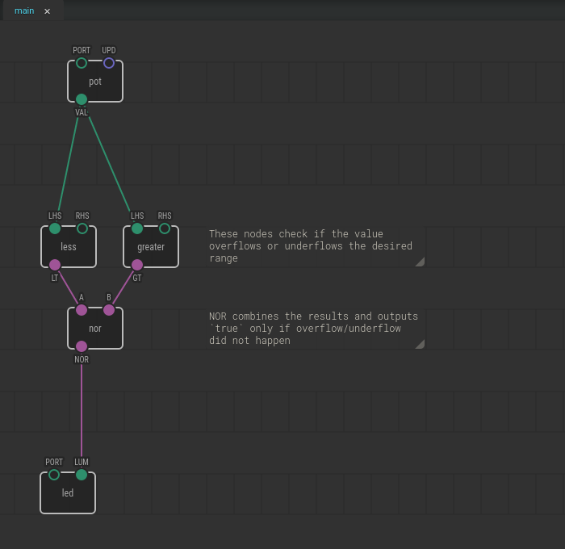
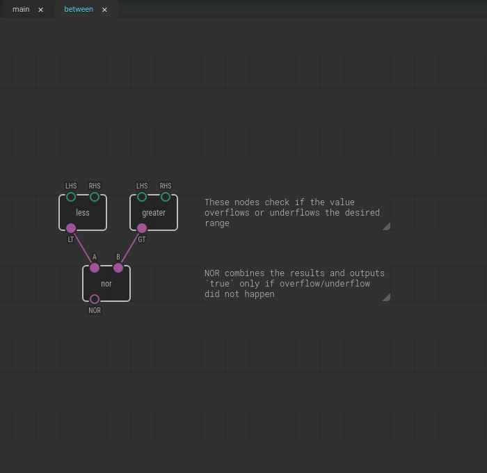
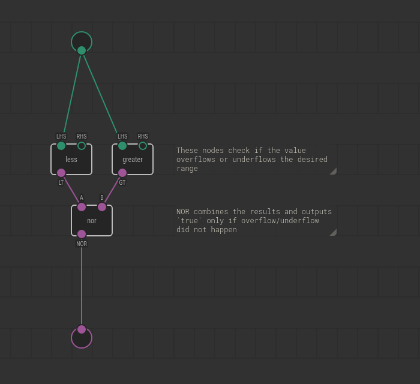
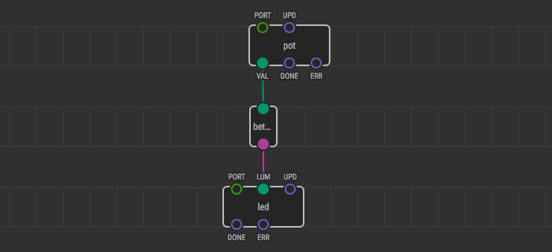
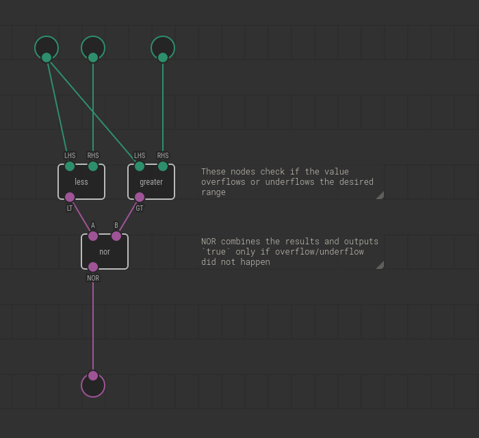
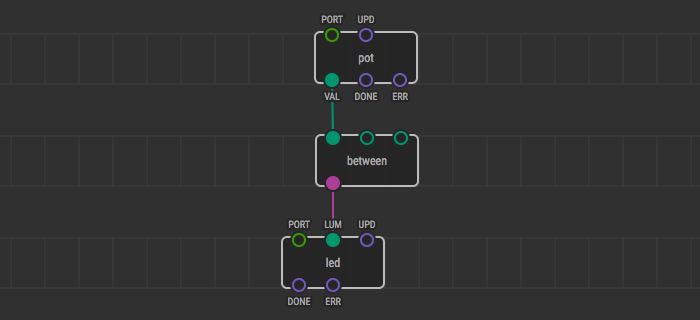
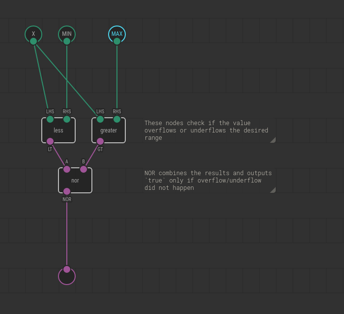
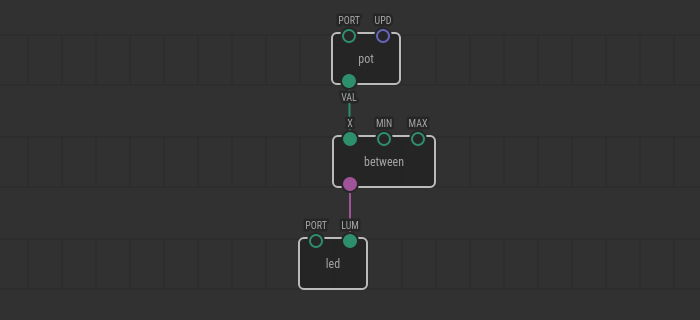

# Creating Nodes for XOD in XOD

The most straightforward way to create a new node in XOD is composing the new
one from existing nodes. The process outline is:

1. Create a new patch.
2. Link few existing nodes together to implement a feature.
3. Add input and output nodes so that one can adjust the node
   behavior and consume results.
4. Done! Use the newly created patch as a node on other patches.

Because of the dual nature of the patches, nodes implemented this way are
called *patch nodes* in XOD. They are patches and nodes at the same time.

Note
If you’re familiar with object-oriented programming, think of patches as
classes, and nodes as their instances.

## The task

Let’s create a simple but handy node `between` which takes a number value,
min/max limits, and outputs whether the value is between limits or not. I.e.,
it returns `true` if and only if the following is satisfied:

*min ≤ value ≤ max*

## Make it work

Let’s start with a test implementation on a single patch. Create a new project
(File → New Project, or Ctrl+Shift+N), name it something like `my-utils`.

We’ll use a potentiometer as the data source, and a LED to observe the result.
Say, we want to test if the value of potentiometer falls between 0.4 and 0.7
and enable the LED only if the test passes. Combination of
[`xod/core/less`](/libs/xod/core/less/),
[`xod/core/greater`](/libs/xod/core/greater/), and
[`xod/core/nor`](/libs/xod/core/nor/) would do the job:

Upload the program, rotate the knob to verify all works as expected.

## Create new patch

We’re ready to make the “between” check reusable. First, you need to create a
new patch which will define the new node. Hit “File → New Patch” or Ctrl+N,
enter `between` as the name. It will be used by XOD for node name as well.

Now move the `less`, `greater`, `nor` nodes from the `main` patch to the new
patch. Use cut/paste (Ctrl+X/Ctrl+V) to done it.

## Add terminals

Now, we need a way for the `between` node to get values in and put values out.
In XOD patch nodes interact with the outside world using *terminal nodes*. You
can find the terminal nodes in `xod/patch-nodes`, they are `input-number`,
`input-pulse`, `output-boolean`, etc.

We are interested in an `input-number` and an `output-boolean` since we take an
arbitrary number for comparison and output a true/false value. Add and link
them like any other node. Note terminals are rendered as circles because
they’re very special.

## Use it

Switch back to the `main`. Drag and drop the `between` node there. Link it to
the `pot` and `led` so that it acts as a medium.

That’s all! The node is ready and works. Upload the modified version of the
`main` patch to your board and verify our brand new node `between` really
works.

## Expose parameters

We compare to hard-coded limits 0.4 and 0.7. Of course, a node user would
desire to adjust the limit values depending on his task. Let’s make it
possible. It is as easy as adding two more input terminals.

Look at the `main` patch now. Whoa! The `between` node has got two extra pins.

But which one corresponds to which terminal? In XOD nodes show their pins in
the same order as their corresponding terminals are arranged along the X-axis.
So here we have the value, min limit, max limit.

## Add labels

In most cases, it is a good idea to specify pin labels explicitly so no one
would be confused. Pins get their labels from labels of their terminal nodes.

Open the `between` patch, select input terminals one after another and set
their labels via Inspector.

Note
Conventionally XOD uses pin labels that are similar to IC leg labels. The
labels can contain at most four characters, and usually, they are mnemonics or
abbreviations. The restriction allows rendering patches quite densely.

How did assigning the terminal labels reflected in the `main` patch? Let’s see.
Pin labels became much more clear and explicit.

If it would make you happier, move the `X` terminal between `MIN` and `MAX` and
see how the order of pins on the node changes.

## Conclusion

Composing new nodes in XOD is not a big deal. Use it to make programs more
clear, share functionality, and reuse your own past work.

The provided example is pretty basic. If you want to learn more, follow a
[guide to make an analog sensor driver node](../analog-sensor-node/).
