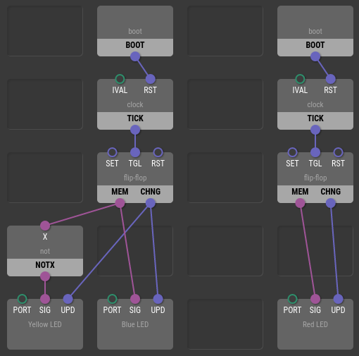
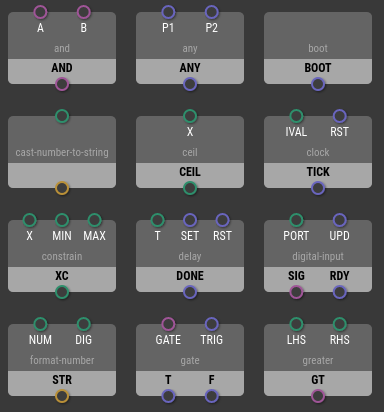
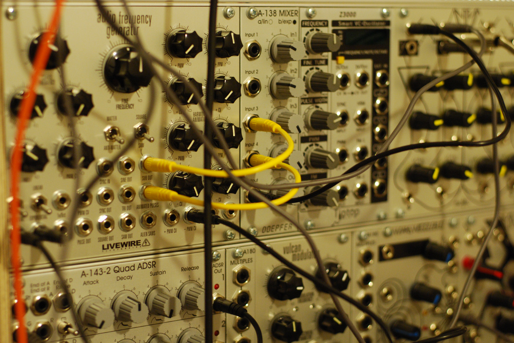

Program Structure
=================

XOD programs are quite similar to electronic circuits. To build an
electronic circuit, you use various electronic components and connect them
with wires. In a XOD program, you use *nodes* and connect them with *links*.

Nodes
-----

What a node does depends on its type. Just as there are ICs in the physical
world to control motors, amplify audio signals, and store data, in XOD there
are many types of nodes available. You can also easily create your own.

Some nodes represent physical devices like LEDs or digital thermometers. Others
are used to transform and filter data. Here are few examples:

* [`thermometer-tmp36`](/libs/xod/common-hardware/thermometer-tmp36/)
* [`console-log`](/libs/xod/core/console-log/)
* [`add`](/libs/xod/core/add/)
* [`to-percent`](/libs/xod/core/to-percent/)

You place the nodes you’ve chosen for your program into slots to be later
connected with links.

Pins, inputs, and outputs
-------------------------

Nodes alone are black boxes. They expose *pins* to support interaction. Think
of pins as of sockets, ports, IC legs, and jacks.

A pin can be either an *input* or an *output*. Once you feed a new value to an
input, the node is evaluated. In response, it may update the values on its
output pins or interact with the real world in some way, e.g. change a motor's
speed.

Some nodes send an output on their own as a reaction to some external event.
For example, the [clock](/libs/xod/core/clock/) node sends outputs at regular
time intervals.

Pins are depicted as holes with short labels. Inputs are placed on a darker
background, and outputs are placed on a lighter background.

Links and values
----------------

Nodes talk to each other by transmitting values over *links*. A link is a kind
of wire that you use to connect one node's output to another node's input.

Values in XOD are quite similar to electric signals. However unlike their
electric counterparts, they can carry not only raw voltage values, but also
more sensible data like arbitrary numbers and text strings. Learn more about
values in the [Data Types](../data-types/) article.

In digital electronics, voltage values are switched discretely, usually
accompanied by some kind of clock signal. The clock signal is seen as a
sequence of “moments” defined by the falling or rising signal edges on the
clock line. Interactions and changes actually happen at these moments, i.e. a
digital circuit is static until a new clock signal appears.

Values behave very similarly in XOD. They change and propogate
instantly. These cascading value updates are called *transactions*. In XOD, the
role of clock signals is played by *pulses*. The [Execution
Model](../execution-model/) article describes how they work in detail.

There are a few rules that define which pins are allowed to be linked and which
are not. They are intuitive enough, but for a formal description see [Linking
Rules](../linking-rules/).

Patches
-------

Nodes linked together form a *patch*. Patches are like modules, documents, or
files in other programming systems.

You would have a single patch in a simple project, while you’d likely have
many for complex projects.

What makes a patch interesting is that once you’ve created one you can use it
as a new type of node in other patches! That’s the main idea behind XOD
extensibility.

You use special *terminal nodes* to denote input and output pins when a patch
is used as a node.

  
    Photo by
    <a href="https://www.flickr.com/photos/26735065@N00/">cutwithflourish</a>.
  
  

    Note
    Perhaps you’ve heard of modular synthesizers - they are very similar to XOD
    programs. Nodes are modules, links are CV cables with banana connectors,
    and patches are a rack chassis for modules.
  

  

    
  

