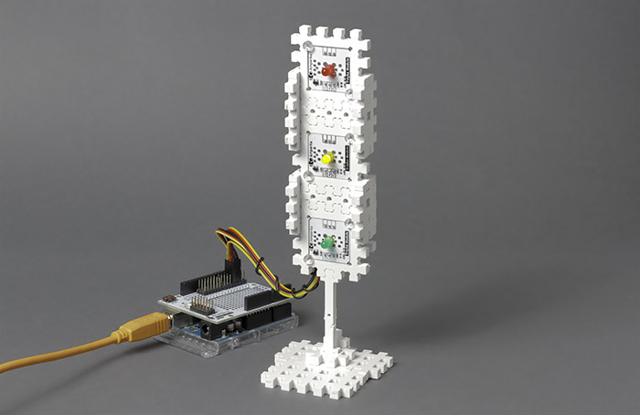
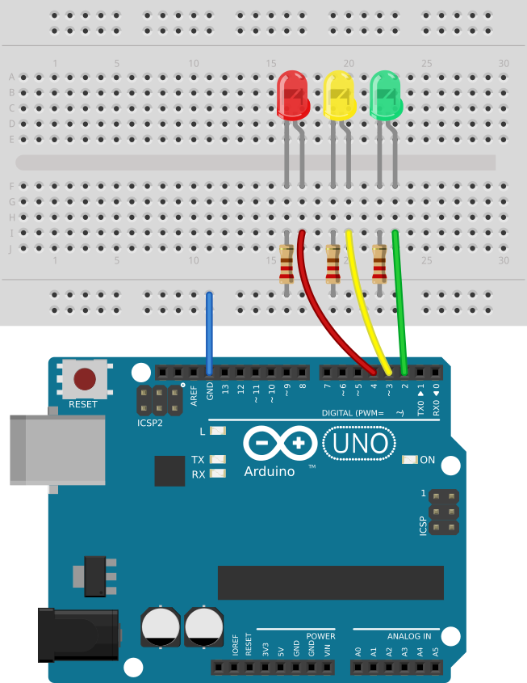
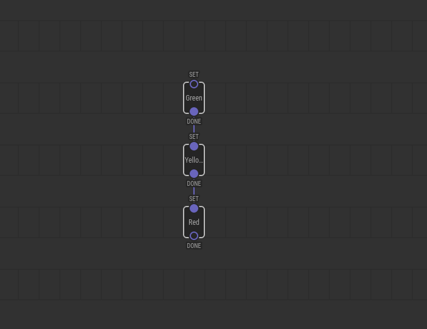
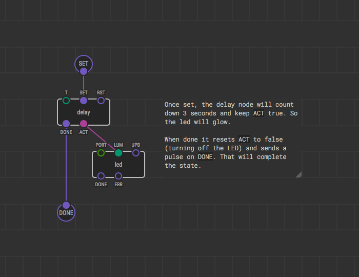
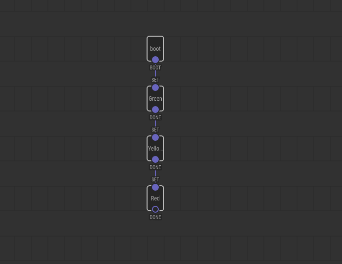
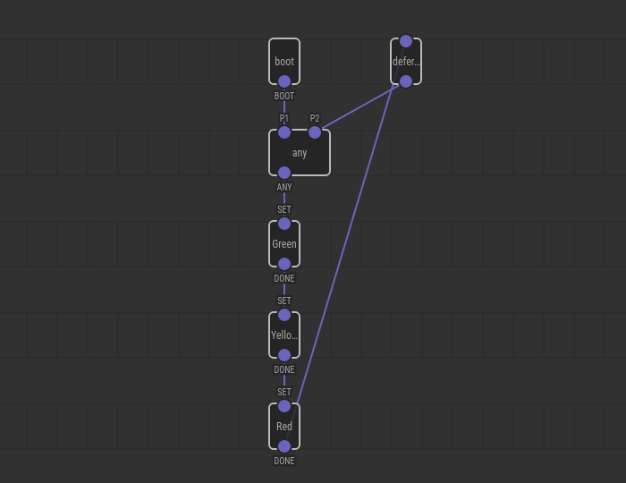

# Simple Traffic Light Example

A traffic light is a good example of a device which does its job sequentially.
In its simplest form a traffic light has three states:

1. Green — go
2. Yellow — stop if you can
3. Red — stop!

Each state is active for some time interval and when done everything starts
from the beginning and repeats again and again.

Let’s make a traffic light device model with few electronic parts and XOD.

## Circuit

## Program structure overview

Create a new project in XOD and name it something like `my-traffic-light`. Now
you have a program with a single patch `main`. What’s next?

We have a state machine that we’re going to implement. There are several ways
to do the job. Let's consider one of them. The basic idea is to have one patch
node per state and a joining patch that will wire the state patch nodes
together. In our case:

- `state-green`
- `state-yellow`
- `state-red`
- `main` — the joining patch

We plan to (a) create drafts for all state patches, (b) craft the main patch,
and (с) after that complete the state patches. You can do things in reverse if
it makes more sense to you.

We already got the `main`, so create the state patches. Hit “File → New Patch”
(or Ctrl+N) and enter the new patch name. Repeat three times.

Note
Although naming the state patches with <code>state-</code> prefix is not
required doing so is a good idea. It shows the patch designation and simplifies
program understanding.

Now we need a mechanism allowing patch nodes to talk to each other. A common
idiom is to make a pulse input on a state patch to enter that state and add
pulse outputs to notify about state completion.

Add a pair of `xod/patch-nodes/input-pulse` and `xod/patch-nodes/output-pulse`
to each state patch:

Now each of our states has an input and output. We can wire them in a daisy
chain so that when one state completes its job, it gives the control to the
next state. Let’s do it on `main`:

We gave shorter labels “Green,” “Yellow,” and “Red” to our nodes so the text
could fit the width.

Nice, isn’t it? You see how the device should work graphically.

## Implementing state patches

OK, we’ve got a basic state patch skeleton, let’s fill it up. You’re going to
answer few questions before doing that.

- What should a state do once entered?
- When should it exit?
- What should it do right before exit?

In our case, when we enter a state it should turn on the corresponding LED.
Then it should wait few seconds, turn the LED off and then exit. Pretty simple.
Do it for the `state-green`:

Set proper values for [`led`](/libs/xod/common-hardware/led/)’s port (port 2)
and `T` of the [`delay`](/libs/xod/core/delay/) (3 seconds is fine for the
experiment).

We have done with the green. Are yellow and red differ anyhow? Not in our case.
Just replicate the patch on `state-yellow` and `state-red`. Do not forget to
adjust `PORT` and `T` values. Use copy/paste to do it quickly.

Note
A clever xoder would see the pattern and avoid duplication by creating a
patch node with all the logic put within. And he is right. But for the sake of
the guide brevity, we violate the best practice.

## Running the sequence

We are almost done. The only thing left is triggering the execution. Look at
the `main` again:

Although the states are correctly chained, nothing would trigger entering the
first state (i.e. the `state-green`). We want our traffic light to start its
job right when the device is powered up. So a pulse from the
[`boot`](/libs/xod/core/boot/) node is the best choice:

Finally, upload the program to your board and see how they behave.

Whoa, it works! Almost. Once the red state completes the traffic light does
nothing. Let’s fix it

## Making a cycle

The device suspends after the last state because nothing returns it back to the
first state. We could link the last state `DONE` pulse to the first state `SET`
pulse to complete the loop, but unfortunately, XOD does not allow to do so.

XOD forbids cycles in a program graph to avoid possible deadlocks. No deadlocks
are possible in our particular scenario because we use `delay` nodes but XOD is
not smart enough to figure it out.

Luckily so-called “defer nodes” are here to help us. They can break any cycle
and tell XOD: “Hey, I’m the point where you can take a breath if a deadlock
happens”.

Note
You could ask why XOD does not add a defer node implicitly on each link.
It could, but doing so will introduce more problems than it solves. First, the
<a href="../execution-model/">execution model</a> will break so that
transactions will no longer be atomic. Second, each defer node needs to store
few bytes of data which consumes precious RAM. To avoid the problems, you are
forced to place them manually.

We deal with pulses, so we will use the
[`defer-pulse`](/libs/xod/core/defer-pulse/) node to break the cycle.

Oops. The first `state-green` node input is not allowed to have links from the
`boot` and `defer-pulse` at the same time. We can easily solve it by adding an
[`any`](/libs/xod/core/any/) node:

Whew! Well done. Upload the program and see how it works. Play with timeout
values, try to start the sequence from another state, add three more LEDs to
form a complementing traffic light. Have fun!

## Result

<video controls autoplay muted loop>
    <source src="./result.mp4" type="video/mp4">
</video>

If you have got problems trying to repeat the guide, [download the prepared
project](./traffic-light-simple.xodball) and open it in the IDE.

## Conclusion

Doing things sequentially in XOD could appear hard at first sight. Yes, it’s a
bit harder than in traditional imperative languages, but not so complicated if
you would remember the pattern:

1. Understand your sequence states
2. For each state make a patch node
3. On each state patch, use pulse inputs and outputs to enter and exit the
   state
4. Make a joining patch which wires all states together
5. Define an entry pulse for the first state
