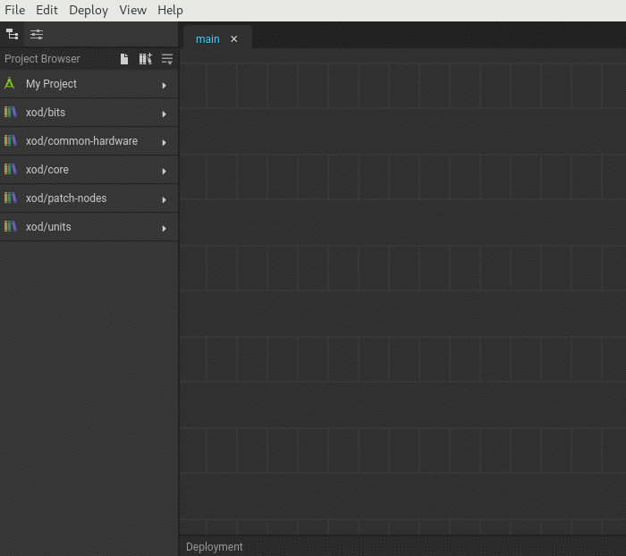

# Using Libraries

XOD includes a package manager as an essential part of its ecosystem. The
package manager stores _libraries_ in the cloud which are collections of
ready-to-use nodes for interfacing with hardware, performing computations,
building logic, etc.

Anyone may create and publish a library. You can
[make and share a library](../creating-libraries/), too. Before that, check
what's already been done. The chances are that someone has already implemented
the node you're looking for. Use the [library explorer](/libs/) on the XOD site
or search the [forum](https://forum.xod.io).

## Installing a library

Each library has a full name in the format `owner-name/lib-name`, where
`owner-name` defines the Xoder who published it while `lib-name` is what he or
she called the library.

In XOD IDE, hit “File → Add Library” and enter the full library name to install
it into your workspace. You'll see a new entry in the project browser panel with
a spinning wheel. A few seconds later, you should see a message about successful
installation.

That's it! You're ready to use nodes from the newly installed library.

Note

There are libraries by someone called “xod”: `xod/bits`, `xod/units`,
and so on. They are regular libraries although installed automatically along
with XOD. Together they form the XOD _standard library_.

## Upgrading and downgrading

Every library has a version number attached at the moment of publication. A
particular library, say `bob/cool-lib`, can be published by `bob` multiple
times, i.e., it has multiple versions. That's a way for library authors to add
updates, improvements, and fixes to their libraries.

XOD employs the so-called “[semver](https://semver.org/)” convention: the
version numbers consist of three parts separated by dots. For example, 2.4.1.

When adding a library, you can force a particular version to be installed by
adding the `@` sign and the desired version: `bob/cool-lib@2.4.1`. Installing a
version that differs from the version already installed will override the local
library. This is a way that you can upgrade and downgrade.

To keep things under control, XOD does not support multiple side-by-side copies
of the same library at different versions by design.

There's a special version tag `latest` which corresponds to the greatest version
of a given library. When you hit “File → Add Library” and enter just
`bob/cool-lib`, it has the same effect as entering `bob/cool-lib@latest`.

Therefore, you can add an already-installed library again at `latest` to upgrade
it to the latest version if new library releases were made after you've
installed it for the first time.

A library published with a particular version will never change. Deleting and
overriding a version in the cloud is prohibited. So, if you used a node from
some library, you can be sure you'll find it there at any moment in the future.

## Deleting libraries

The browser version of XOD IDE does not store installed libraries across
launches. Every time you reload a tab with XOD IDE, all third-party libraries
disappear. Only the libraries an opened project depends on are automatically
installed again. So, to delete a library from the browser-based IDE, reload the
IDE.

The desktop version is different. When you add a library, its copy is stored
locally at `<workspace>/__lib__`, where `<workspace>` is a current XOD
workspace path (defaults to `<user-home-directory>/xod`). All libraries from
this directory show up in the project browser when IDE starts. To delete a
library:

1. close IDE;
2. remove the corresponding library subdirectory with your file manager;
3. start IDE.

If you accidentally deleted a library your project depends on, it will be
installed again automatically when you open the project, recovering the problem.
