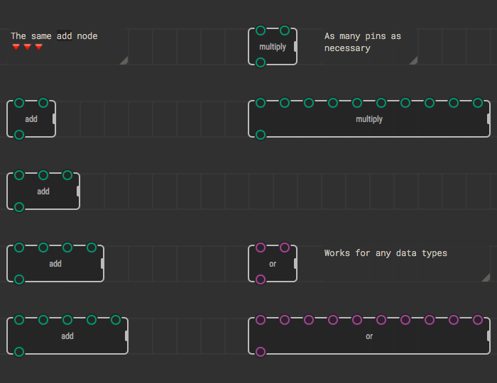
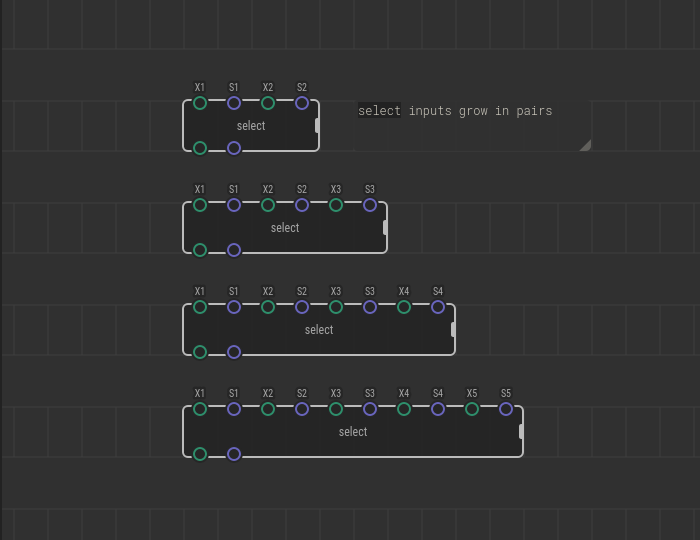
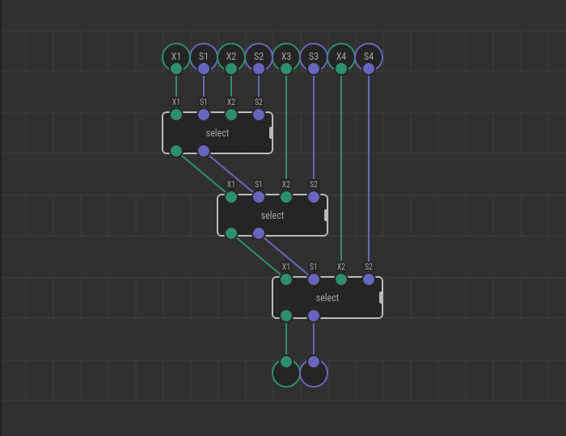
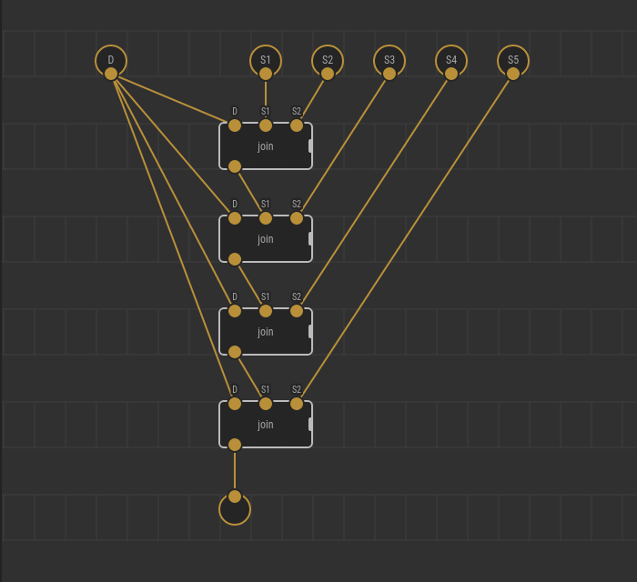

# Variadic Nodes

There are operations which can be applied to an arbitrary number of input
values. For example, consider the addition operation. Sure, intuitively you
know how it works for two values, three values, or 42 values:

* 1 + 6 = 7
* 1 + 6 + 3 = 10
* 1 + 6 + 3 + …more summands… = someNumber

Other examples of such functions include number multiplication, string
concatenation or joining, booleans AND’ing or OR’ing, n-th element choice, and
so on.

To natively support such operations, XOD offers a mechanism called *variadic*
nodes. The variadic nodes can scale the number of their input pins to accept
more or fewer values.

In XOD IDE the variadic nodes have a little gripper on the right, and the pins
which can scale are marked with the ellipsis (⋯) on mouse hover. Drag the right
border of the node to add as many groups of variadic pins as you need.

The variadic pins replication count is called *arity level*. By default, the
arity level for a node is 1. When you add a pin to, for example, the `multiply`
node, the arity level becomes 2, etc.

## Expansion

A variadic node developer is responsible only for creating a node
implementation for the first arity level. All subsequent arity level
implementations are induced automatically by XOD. To achieve it, when
transpiling the program each particular variadic node passes an *expansion*
stage in which the system replaces it with a cascade of primitive level-1
nodes. The replacement principle is better illustrated with an example.

Pro
Developers with functional programming experience could note the expansion is
nothing more but a reduce/fold operation. Indeed! XOD variadics work through
input value list folding.

## Bigger arity steps

In the examples above the nodes have exactly one variadic pin. It is not always
the case. Nodes may have two or three variadic pins. An example of such node is
[`select`](/libs/xod/core/select/) which have two. Every time you increment an
arity level of the `select` node it gets two additional input pins.

Formally speaking, the number of variadic input pins which replicate together
in a group is called *arity step*.

Expansion process for the nodes with an arity step greater than one looks
similar.

## Shared pins

When a variadic node has more inputs than necessary to expand it, the leftmost
extraneous pins are shared between all nodes in the cascade.

For example, consider textual string join operation which concatenates input
strings placing a specified delimiter between them (e.g., space or comma). The
delimiter will be shared between all expanded nodes, so you’ll get the result
you expect.

In the example above there was a single shared pin. However, there can be more
if the author decided the node to be so.

---

As a node user, you’ll rarely meditate on which pins are shared, and which are
not. The usage pattern should be pretty apparent from the node designation.

Arranging pins properly is a puzzle for the node creator. Read about all rules
and nuances if you want to [create a new variadic
node](../creating-variadics/) by yourself.
