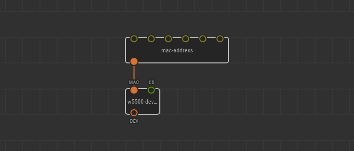
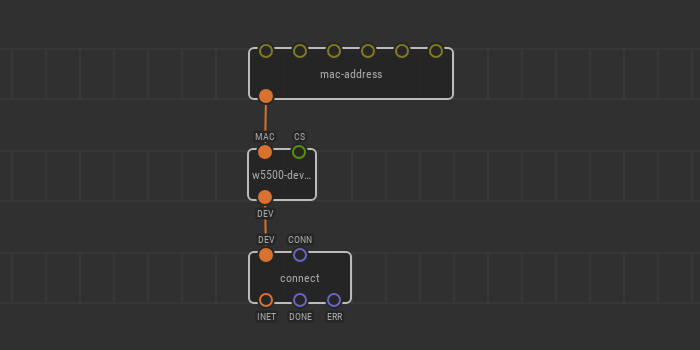
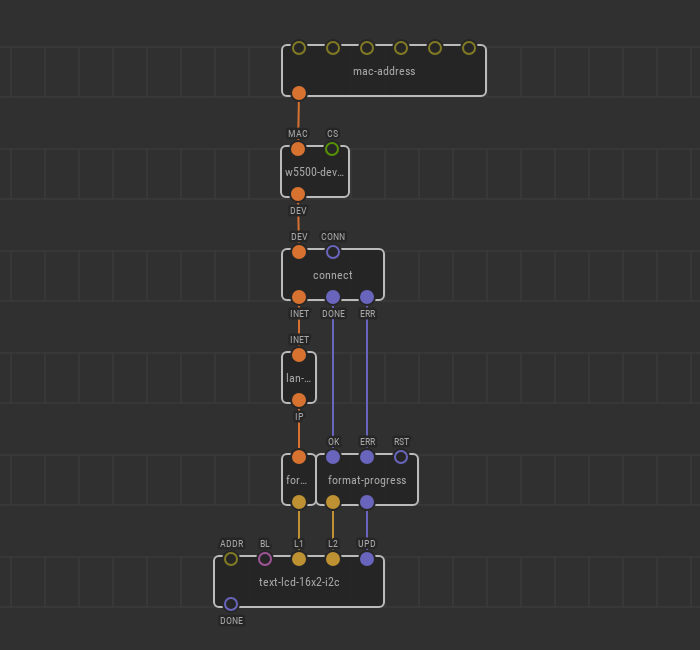
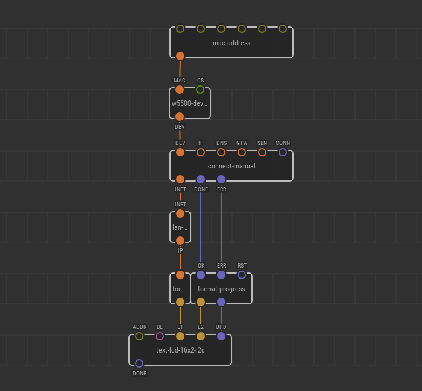
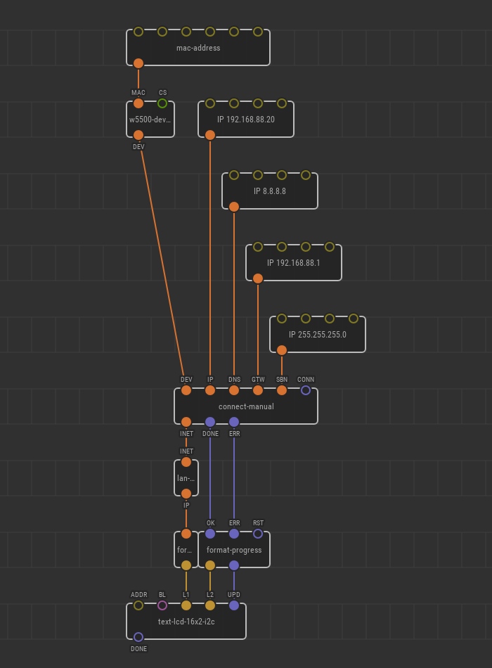
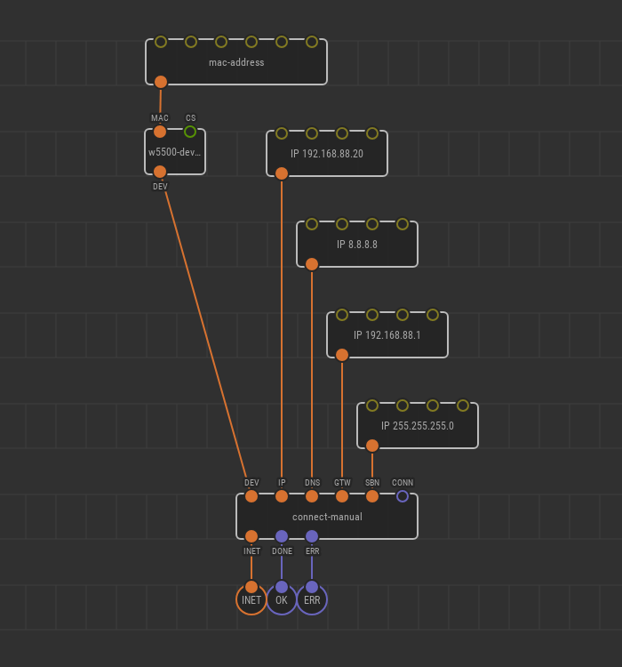

# Advanced Setup of W5500 Ethernet Shield for Internet

If you have an Ethernet Shield extension board based on a W5500 chip, it might
be enough to place a single node for establishing an internet connection.
Start with [Quick setup](../w5500-connect/) guide to see if it fits your needs.
In cases when more control is required you have to build a chain of several
nodes which is described in this guide.

## Adding device node

First, you need to place a node which represents the shield:
[`xod-dev/w5500/w5500-device`](https://xod.io/libs/xod-dev/w5500/w5500-device/).

The node has an input `CS` which defines the chip select port for W5500 IC.
Leave it with the default `D10` value for the standard shield as it physically
wired to this port on the shield printed circuit board.

## Assigning MAC address

Another `w5500-device` input is `MAC`. It defines the so-called
[MAC address](https://en.wikipedia.org/wiki/MAC_address) which is (roughly) a
kind of serial number for network devices. All network devices should have a
unique MAC address. At the very least, a router uses it to lease the same IP
address to a device when it shuts down and then powers up again.

You should find a personal MAC for your hardware printed on a sticker in a form
like “DE:AD:BE:EF:FE:ED”. The W5500 chip does not hard-code its MAC as many
consumer devices do, so you have to provide it manually.

Place a [`xod/net/mac`](https://xod.io/libs/xod/net/mac/) node and link its
output to the input of `w5500-device`.

It has six inputs which denote each octet of the address. Octets are
conventionally separated with colons when written in text, but they are not
parts of the address on the data level. The parts are _bytes_ values of which
are written as hexadecimal numbers between them. So, for example, if the address
is “DE:AD:BE:EF:FE:ED” you need to bind the following values to `mac` in
Inspector:

- `DEh` for `IN1`
- `ADh` for `IN2`
- `BEh` for `IN3`
- ...etc up to `EDh` for `IN6`

The `h` suffix denotes a
[hexadecimal byte value](/docs/reference/data-types/#byte-literals) in XOD.

## Connecting to LAN with DHCP

Now, when the Ethernet Shield device is properly configured, we can connect to
LAN. The simplest way to do it is the
[`xod-dev/w5500/connect`](https://xod.io/libs/xod-dev/w5500/connect/) node.
Place it and link to the device node:

The `connect` node has a `DEV` input expecting a configured device. The rest
works in the same way as described in the [Quick setup](../w5500-connect/)
guide for the `ethernet-shield` node:

* `CONN` initiates the connection process with the DHCP negotiation
* `INET` represents the resulting internet connection
* `OK` or `ERR` pulse on success or failure

To check the connection you can use `lan-ip`, `format-ip`, and `format-progress`
nodes:

## Connecting to LAN with static IP

As an alternative to connecting via DHCP, you may prefer to connect manually
with specific network parameters. Although the process is a bit more
complicated, it makes your device more robust in the case of persistent hardware
setup.

While connecting manually you have to provide your gateway IP, DNS, network
mask, and own IP explicitly, but on other hand, you make connection quicker and
save a few dozen bytes of precious memory because the microcontroller does not
have to remember DHCP protocol details.

To establish a link with static IP and network parameters, use
[`xod-dev/w5500/connect-manual`](https://xod.io/libs/xod-dev/w5500/connect-manual/)
instead of `connect`.

The node has several inputs of type
[`xod/net/ip-address`](https://xod.io/libs/xod/net/ip-address/) to specify the
LAN parameters. Use an `ip-address` node for each of the inputs.

The `ip-address` node has four inputs which represent the four octets (bytes) of
an IPv4 address. When written in a text the octet values are separated by dots,
but they are not the part of IP address per se, so to specify “192.168.0.1”
address, for example, bind the following values:

- `192d` for `IN1`
- `168d` for `IN2`
- `0d` for `IN3`
- `1d` for `IN4`

The `d` suffix denotes a
[decimal byte value](/docs/reference/data-types/#byte-literals) in XOD.

## Encapsulating Internet

There is a clear mental line between connecting to the internet and using it. In
real projects that are more complex than trivial, it is a good idea to put all
the boilerplate related to the connection on a separate patch node. That way you
can just use your own node `internet` when a connection is required without
thinking about setting up again and again.

Here is a possible `internet` node implementation.

Note how we used a `xod-dev/w5500/output-w5500-internet` and two
`output-pulse`’s for output terminals. Later you can change your mind and change
network settings or even the hardware module just by tweaking the `internet`
patch and the _use_ of the internet will remain simple.

---

Whatever connection method you used when you have a working `INET` connection,
you are ready to use it for something useful. Proceed to
[Fetching data from web with HTTP GET](../http-get/) for an example.
