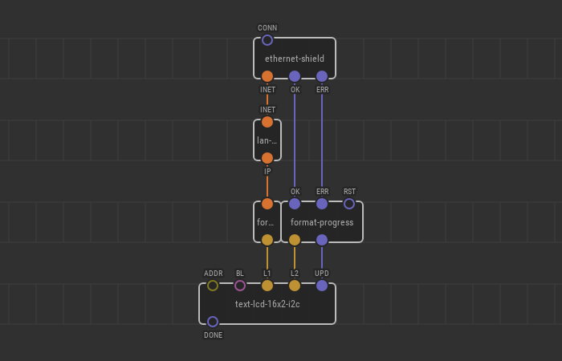

# Quick Setup of W5500 Ethernet Shield for Internet

Ethernet Shield built around the W5500 ethernet chip is a popular extension
board in the Arduino world to give your device a wired connection to a local
network or internet. The board is also known as “Ethernet Shield 2.”

Its physical connection is trivial:

1.  Put Ethernet Shield onto your Arduino board
2.  Connect it to a router which provides internet access with an ordinary RJ-45
    patch cord cable

Programming requires some effort though.

When you connect a PC to the router with a cable, in most cases, it
automatically links to the local area network (LAN), and you are ready for
browsing. You don’t have to do anything because your operating system (OS) be it
Windows, macOS, or Linux takes care and performs all the steps required to enter
the LAN. Microcontrollers don’t have an OS, so you’re responsible for
establishing the connection.

Fortunately, there are nodes for the Ethernet Shield to make it simple in XOD.
Hardware specific nodes for it are in the
[`xod-dev/w5500`](https://xod.io/libs/xod-dev/w5500/) library and
hardware-neutral nodes are in [`xod/net`](https://xod.io/libs/xod/net/).

## Ethernet Shield node

In the simplest case, when you have a stock Ethernet Shield board and it’s the
only DIY-device in your local network it is enough to place a single
[`xod-dev/w5500/ethernet-shield`](https://xod.io/libs/xod-dev/w5500/ethernet-shield/)
on your patch.

The node has a `CONN` pulse which initiates the connection process. Make sure
the `CONN` is bound to `On Boot` so that the shield tries to connect to the
router when the program starts.

The node outputs `INET` which represents the resulting internet connection along
with `OK` and `ERR` pulses which fire on success or failure.

When `enthernet-shield` receives a pulse on `CONN` it starts negotiating network
parameters with the router and automatically sets up the device’s IP address,
gateway address, network mask, and DNS server IP. Upon successful connection,
the node emits a pulse on `OK` and sets `INET` to a value which is expected by
other nodes made for network communication.

The most straightforward way to check whether the link is up is to output own
local IP address. The
[`xod-dev/w5500/lan-ip`](https://xod.io/libs/xod-dev/w5500/lan-ip/) can extract
the IP address from `INET` object and
[`xod/net/format-ip`](https://xod.io/libs/xod/net/format-ip/) is capable of
formatting the IP as a human-readable string like “192.168.1.101”. You may use
an LCD or a watch node to see the result:

For demonstration purposes we also use a `format-progress` node here which
outputs a string “...”, “OK” or “ERR” to the second line of the display
showing the connection progress.

Upload the patch to your board. In an ordinary network it will show:

- “0.0.0.0” / “...” for less than a second
- then something like “192.168.1.101” / “OK”

## Implications

Beware, the quick way described here has some drawbacks:

- It assigns a locally administered hard-coded MAC address “02:00:00:78:6F:64”
  to the device which should be unique in a network. You should change it if you
  have multiple devices or assign an address from the commercial pool if the
  device intended to be sold.
- It always uses DHCP to obtain network settings which might not be configured
  on your router and even if set up properly consumes precious microcontroller
  resources if compared to the static configuration.

If you are OK with the basic connection, you can start network communication.
For example, [fetch some data from the web with HTTP GET](../http-get/).
Or you can make your connection more robust by using a [unique MAC and static
IP setup](../w5500-advanced/).
