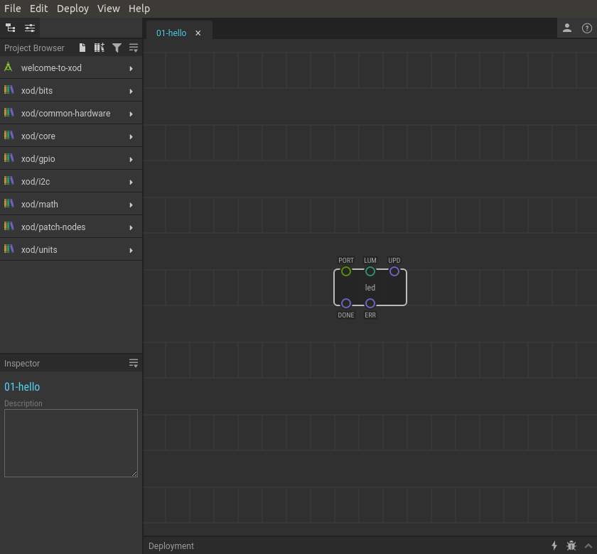
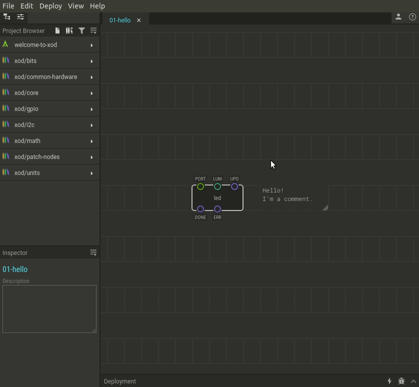

# #01. Welcome to XOD

Note
This is a web-version of a tutorial chapter embedded right into the XOD IDE.
To get a better learning experience we recommend to install the
<a href="/downloads/">desktop IDE</a> or start the
<a href="/ide/">browser-based IDE</a>, and you’ll see the same tutorial there.

Welcome to XOD, dear Maker! Here, in XOD, we do not use text to code, but
visual objects instead.

## Patch board

The large gray field with a box is your program. It’s called a *patch*. In this
patch you can see one interesting object – the `led` node — a grey rectangle
with little circles. You will be able to make complicated programs, using these
rectangles.

You can move nodes by dragging them. Position on the patch board does not
affect your program, but can make it more readable.

You can see a comment as well. Even though it is there, it does not affect the
patch, because it is invisible to a machine. It’s only visible to you, a
clever human. You can drag it to move too.

## Project browser

On the left side you will find a list of patches grouped by a project or
library name. The list is called a *Project Browser*. When you launch XOD for
the first time the first item in the list is `welcome-to-xod`. This is a
special tutorial project you can follow to learn XOD right inside the XOD IDE.

To expand a project click on it. Projects consist of many patches. The
`welcome-to-xod` is not an exception. You can double-click any patch name to
open it on the patch board.

[Next lesson →](../02-deploy/)
