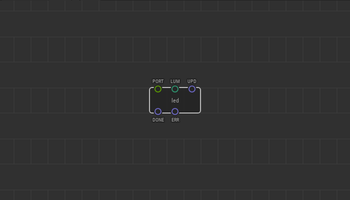
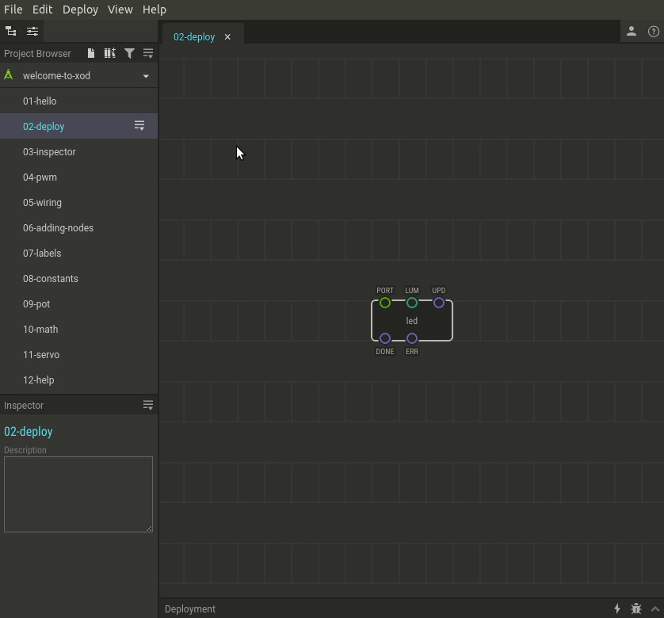
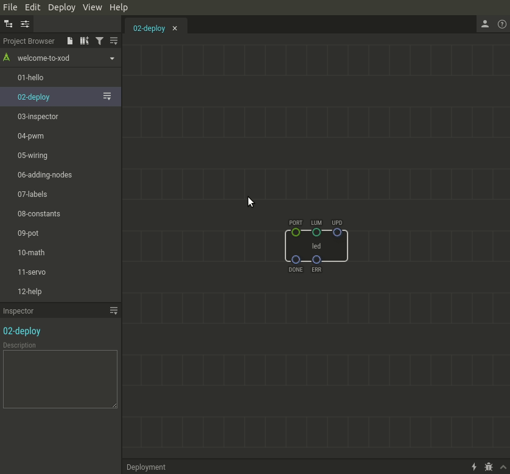

# #02. Загрузка в Arduino

Примечание
Это веб-версия обучения, встроенная прямо в XOD IDE.
Для удобства обучения, мы рекомендуем установить
<a href="/downloads/">desktop IDE</a> или открыть
<a href="/ide/">browser-based IDE</a>, и вы увидите тот же учебник.

Давайте узнаем, как загрузить ваш патч с помощью XOD в Arduino! 
Для примера мы будем использовать `welcome-to-xod/02-deploy` патч. 
Хотя для любого патча процесс загрузки будет одинаковым.

## Схема

[↓ Скачать Fritzing проект](./circuit.fzz)

## Инструкция для версии XOD IDE на ПК.

1. Подключите Arduino к компьютеру.
2. Нажмите “Deploy → Upload to Arduino” в главном меню.
3. Выберите вашу плату и порт к которому подключена Arduino, затем
нажмите “Upload”.

## Инструкция для браузерной версии XOD IDE.

Браузерная версия не имеет доступа к USB порту. Но это не мешает вам использовать установленную на ПК Arduino для загрузки скетча в плату.
Для этого:

1. Соберите схему согласно рисунку выше.
2. Сгенерируйте Arduino код вашей программы. Для этого нажмите
   “Deploy → Show Code for Arduino”. 
   Выделите весь код и скопируйте его в буфер обмена.
3. Запустите Arduino IDE и вставьте код из буфера обмена.
4. Выберите правильный порт и плату в меню “Tools”.
5. Кликните “Upload” на панели инструментов.

Примечание
Если вы раньше видели, какой код нужен в Arduino для мигания светодиодом, 
то вы можете быть изумлены, глядя на количество кода, созданного XOD. 
Не волнуйтесь - большая часть из этого - это код среды выполнения XOD, 
которая фактически создает небольшие накладные расходы после компиляции. 
Вам не обязательно понимать, как это работает. 

Обратная связь
Есть проблемы с загрузкой? Пожалуйста, напишите об этом нам на <a
href="//forum.xod.io">форум</a>. Опишите, что вы делаете, что вы ожидаете
получить, и то, что вы на самом деле получаете. Мы поможем.

