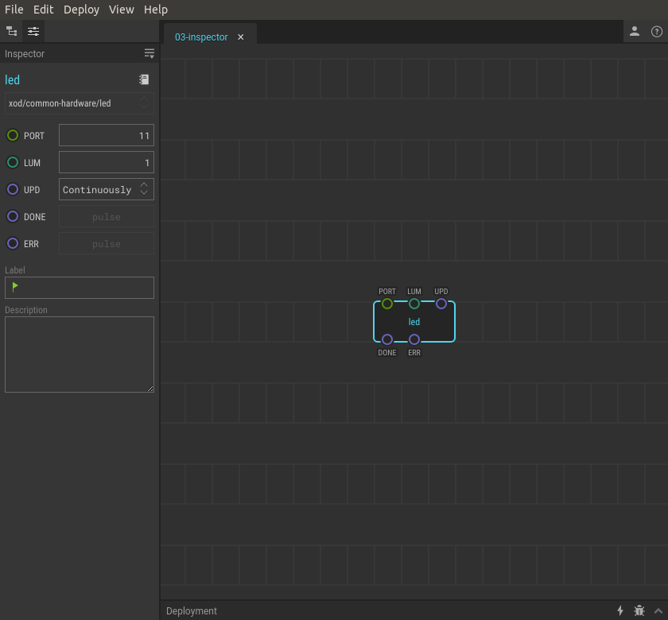

# #03. Pins, data, and the Inspector

Note
This is a web-version of a tutorial chapter embedded right into the XOD IDE.
To get a better learning experience we recommend to
<a href="../install/">install the IDE</a>, launch it, and you’ll see the
same tutorial there.

A node is a visual representation of some physical device (such as the ports on
an Arduino) or some function (adding, subtracting and more complicated stuff).

The `led` is a simple LED controlling node. It can control only a one-colored
LED. The node has only input pins — `PORT` and `LUM`.

## Pins

The small colored circles on nodes are called *pins*. Pins are divided into
inputs and outputs. Inputs are always on the top side of nodes, outputs — on
the bottom.

Pins are used to transfer data between nodes. Nodes process these values and
take some action or give a result. In this example, the `led` node transfers
the led brightnes value (set in `LUM`) to the Arduino port (set in `PORT`).

You can change values of pins with a sidebar called *Inspector*. You will see
the Inspector on the left under the list of projects.

## Test circuit

Note
The circuit is the same as for the previous lesson.

[↓ Download as a Fritzing project](./circuit.fzz)

## How-to

1. Click on a node for which you want to change pin values. In our example, the
   `led` node. It will make the node selected.
2. In the Inspector, change the values you desire.
3. Upload the patch again to apply the changes.

[Next lesson →](../04-pwm)
