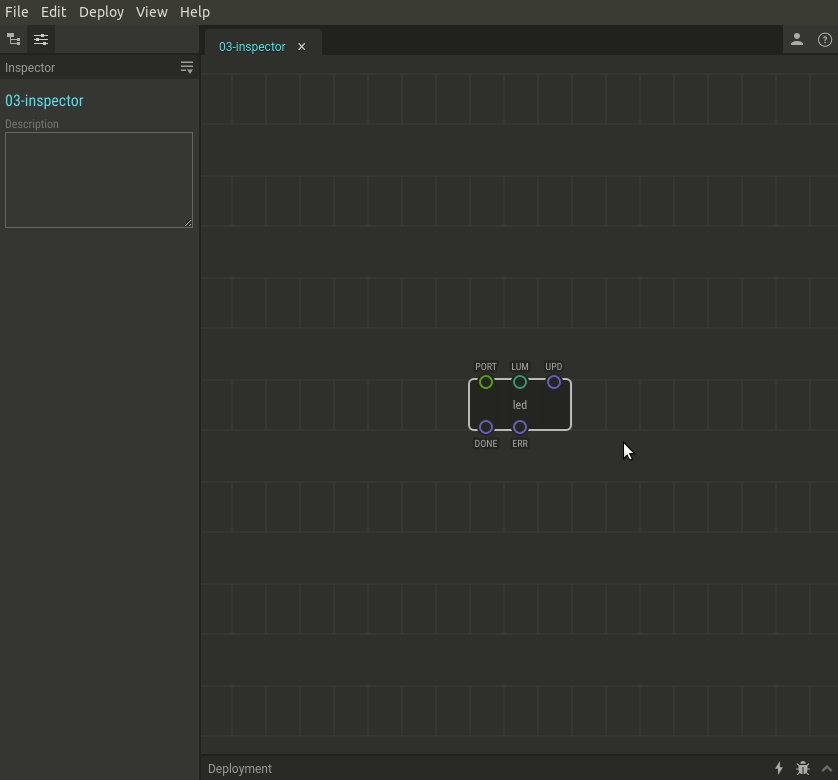

# #03. Пины, данные, и Инспектор

Примечание
Это веб-версия обучения, встроенная прямо в XOD IDE.
Для удобства обучения, мы рекомендуем установить
<a href="/downloads/">desktop IDE</a> или открыть
<a href="/ide/">browser-based IDE</a>, и вы увидите тот же учебник.

Ноды представляют собой визуальное представление некоторого физического 
устройства (например, портов на Arduino) или некоторой функции 
(добавление, вычитание или более сложные функции).

`led` - это простая нода управления светодиодом. Данная нода может управлять 
только одноцветным светодиодом. У ноды есть входные контакты `PORT` и 
`LUM` , а также несколько других контактов, которые вы можете игнорировать.

## Пины

Маленькие цветные круги на узлах называются *pins* (пины). Пины разделены на
входы и выходы. Входы всегда находятся на верхней стороне узлов, выходы - на
нижней.

Пины используются для передачи данных между нодами. Ноды обрабатывают эти 
значения и выполняют какие-либо действия или выводят результат. 
В этом примере нода `led` передает значение led brightnes (устанавливается 
в `LUM`) на порт Arduino (устанавливается в `PORT`).

Вы можете изменить значения контактов с помощью боковой панели с именем *Inspector*. 
Инспектор можно найти слева под списком проектов.

## Схема

Схема такая же, как и в предыдущем уроке.

[↓ Скачать Fritzing проект](./circuit.fzz)

## Как использовать

1. Кликните на ноду, в которой вы хотите изменить значения пинов. 
В нашем примере это нода `led`. Таким образомы мы выбрали ноду.
2. В Инспекторе измените нужные значения.
3. Загрузите в плату патч еще раз, чтобы применить изменения.

