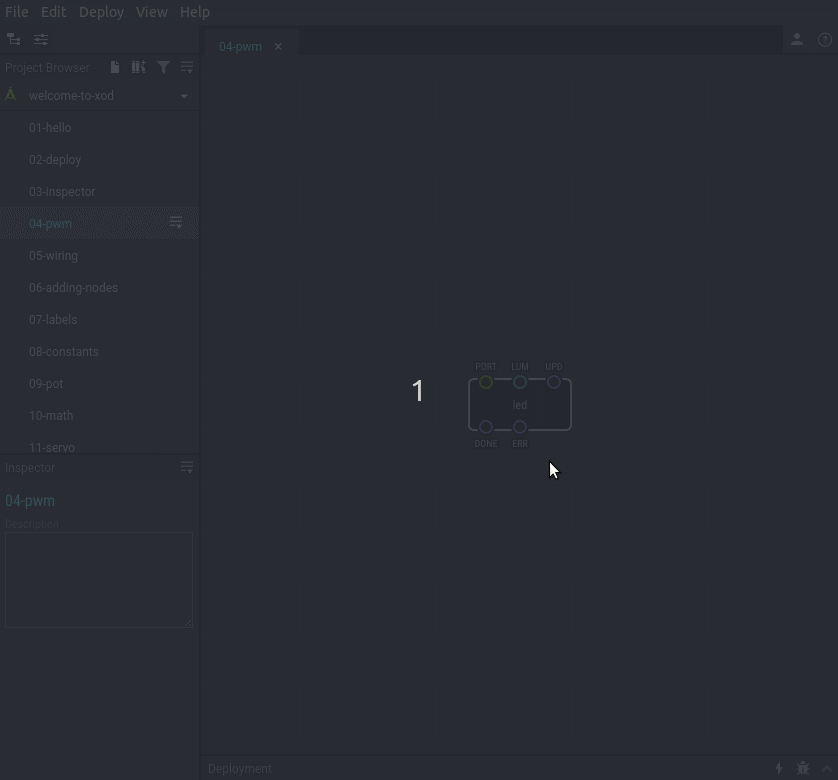

# #04. Fractional Numbers and PWM

Note
This is a web-version of a tutorial chapter embedded right into the XOD IDE.
To get a better learning experience we recommend to install the
<a href="/downloads/">desktop IDE</a> or start the
<a href="/ide/">browser-based IDE</a>, and you’ll see the same tutorial there.

XOD uses fractional numbers (also known as floats) extensively. For example,
the `LUM` pin on the `led` node can take values from 0 to 1.
0 means absolute minimum of LED brightness. Basically, it means that LED is
off. 1 means full brightness. You can control LED brightness by setting
fractional values on `LUM` pin.

## Test circuit

Note
The circuit is the same as for the previous lesson.

[↓ Download as a Fritzing project](./circuit.fzz)

## How-to

Use Inspector to enter a value with floating point. The following notations
are supported:

* 0.4
* .4 (same as 0.4)
* 4e-6 (scientific, 4×10-6 = 0.000004)

[Next lesson →](../05-wiring)
