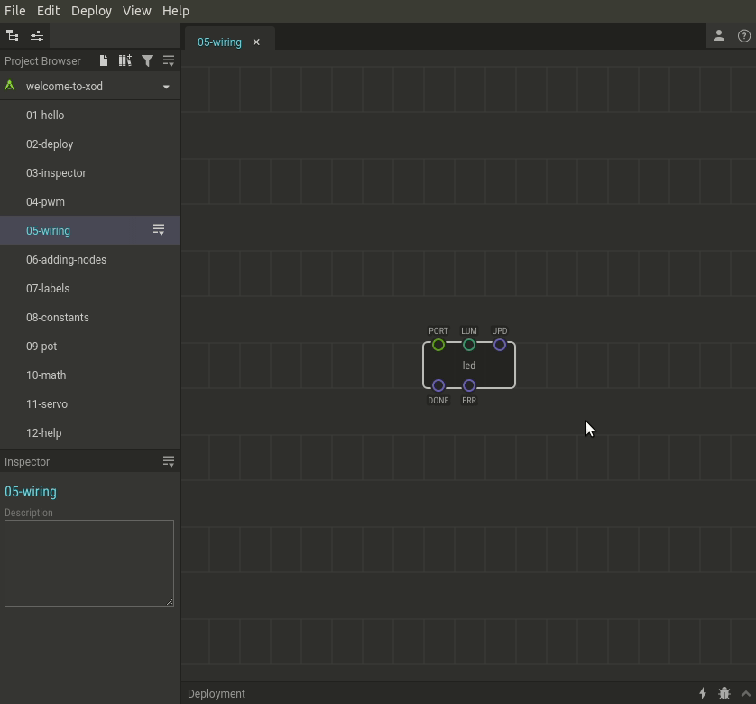

# #05. Wiring Configuration

Note
This is a web-version of a tutorial chapter embedded right into the XOD IDE.
To get a better learning experience we recommend to install the
<a href="/downloads/">desktop IDE</a> or start the
<a href="/ide/">browser-based IDE</a>, and you’ll see the same tutorial there.

Devices are physically connected to digital or analog ports on the Arduino.
To associate them with nodes, you need to inform the node of the port
number that you are about to use.

By a convention the leftmost pins are used to define the wiring information.
If the device is simple and communicates with the Arduino via a single hardware
port the corresponding XOD pin is called a `PORT`.

Note, that many devices require some specific hardware capabilities from the
port they are connected to. Notably, to smoothly control a parameter (like
LED’s brightness) the port should support PWM (pulse width modulation).
PWM-enabled ports have a tilde (~) symbol printed next to their numbers on
Arduino boards.

## Test circuit

[↓ Download as a Fritzing project](./circuit.fzz)

## How-to

You can set port values exactly the same way as you do with other pins.

[Next lesson →](../06-adding-nodes/)
