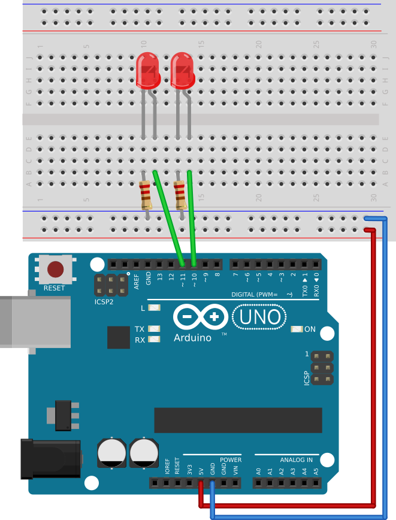
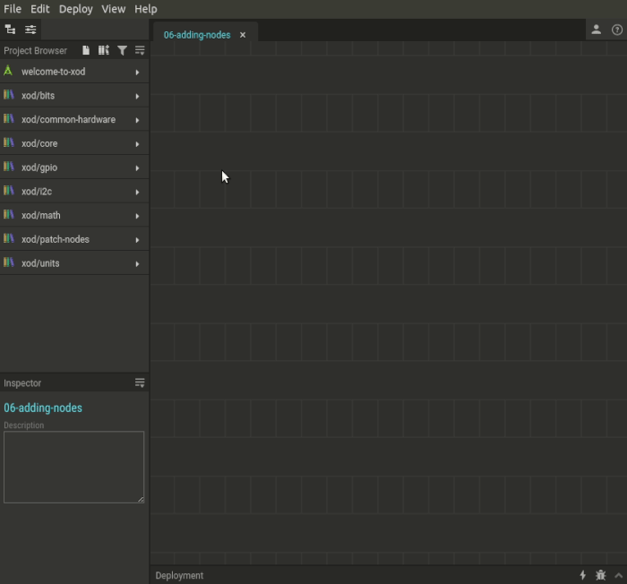

# #06. Adding Nodes

Note
This is a web-version of a tutorial chapter embedded right into the XOD IDE.
To get a better learning experience we recommend to install the
<a href="/downloads/">desktop IDE</a> or start the
<a href="/ide/">browser-based IDE</a>, and you’ll see the same tutorial there.

There are several ways you can add a new node to the patch in XOD. The
effect is the same, use one that is more handy for a given situation.

## Test circuit

[↓ Download as a Fritzing project](./circuit.fzz)

## How-to

For instance, let’s add few new `led` nodes.

One way is using the Project Browser. In the node list, you will find the
`xod/common-hardware` section. This is a *library* where you can find nodes
for working with specific hardware. Find the `led` node there. Note that the
nodes are arranged in alphabetical order. Hover the cursor over the `led` node,
and click the plus <i class="fitted add circle icon"></i> symbol to add it to the
patch. Then drag it to any slot.

Alternatively, you may drag the node from the Project Browser instead of clicking
the  <i class="fitted add circle icon"></i> button.

Yet another way to add a node is the Quick Search feature. Press “I” key or
double click anywhere on the patch. Then type what you are looking for.
It searches not only in nodes titles, but even in the nodes description,
like a small and dumb built-in Google.

[Next lesson →](../07-labels/)
