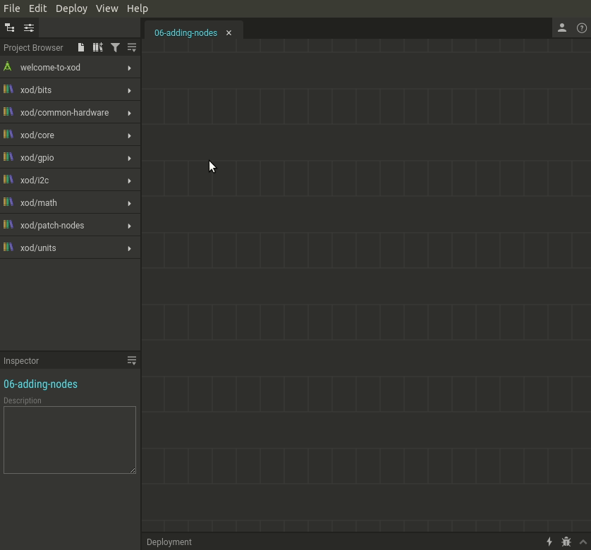

# #06. Adding Nodes

Note
This is a web-version of a tutorial chapter embedded right into the XOD IDE.
To get a better learning experience we recommend to install the
<a href="/downloads/">desktop IDE</a> or start the
<a href="/ide/">browser-based IDE</a>, and you’ll see the same tutorial there.

There are several ways you can add a new node to the patch in XOD. The
effect is the same, use one that is more handy for a given situation.

## Test circuit

[↓ Download as a Fritzing project](./circuit.fzz)

## How-to

For instance, let’s add few new `led` nodes.

One way is using the Project Browser. In the node list, you will find the
`xod/common-hardware` section. This is a *library* where you can find nodes
for working with specific hardware. Find the `led` node there. Note that the
nodes are arranged in alphabetical order. Hover the cursor over the `led` node,
and click the burger 
<svg width="16" height="16" viewBox="0 0 15.864 13.75" role="img" xmlns="http://www.w3.org/2000/svg">
<g transform="translate(-7.139,304.75)"><path d="M 22.998,-304.75 H 7.139 v 1.528 h 15.859 z m 0,4.584 H 7.139 v 1.527 h 15.859 z m -15.859,6.11 h 6.693 v -1.527 H 7.139 Z m 8.216,-1.527 3.825,4.583 3.823,-4.583 z" style="fill:black" /></g>
</svg>  icon to access context menu. There click “Place” then drag it to any slot.

Alternatively, you may *drag* the node from the Project Browser instead of using
the context menu.

Yet another way to add a node is the Quick Search feature. Press “I” key or
*double-click* anywhere on the patch. Then type what you are looking for.
It searches not only in nodes titles, but even in the nodes description,
like a small and dumb built-in Google.

[Next lesson →](../07-labels/)
