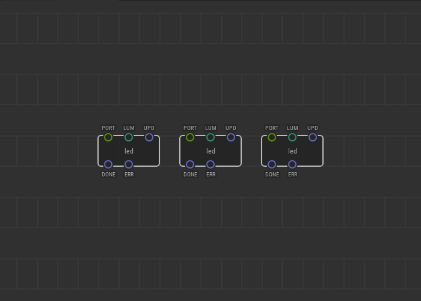
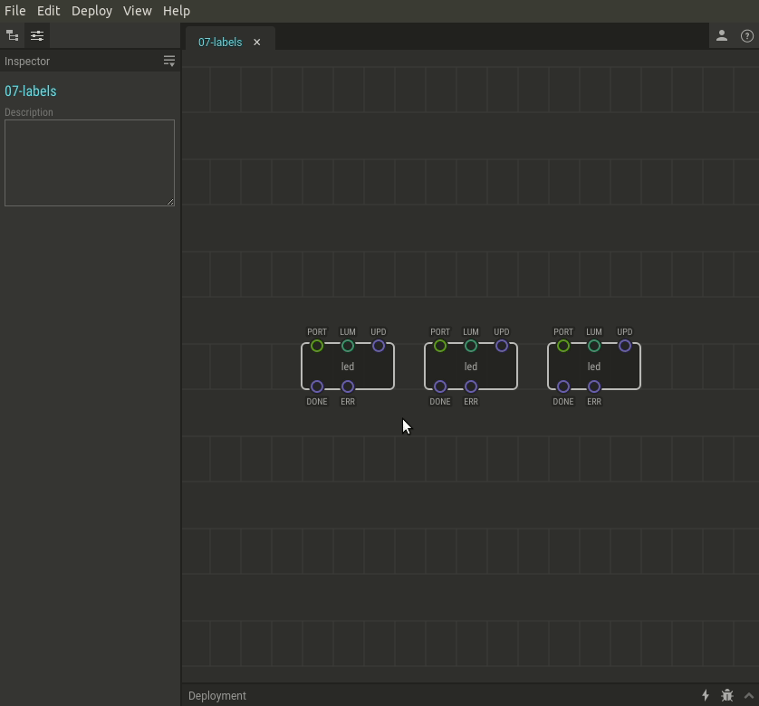

# #07. Node Labels

Note
This is a web-version of a tutorial chapter embedded right into the XOD IDE.
To get a better learning experience we recommend to
<a href="../install/">install the IDE</a>, launch it, and you’ll see the
same tutorial there.

In many cases you would use multiple identical hardware parts to control
different aspects of the device or implement multiple channels of something.
To avoid confusion you can rename nodes.

The function and type of each node remains the same. This feature just makes
your patch more readable. You can always check out the original node type in
the Inspector.

## How-to

1. Select a node you’d like to rename.
2. There is a field with a green flag in the Inspector; you
   can find it above the pins. Type any name for the node into this field.

[Next lesson →](../08-constants/)
