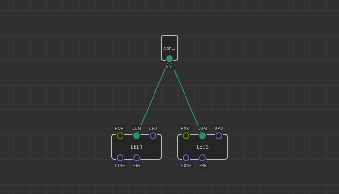
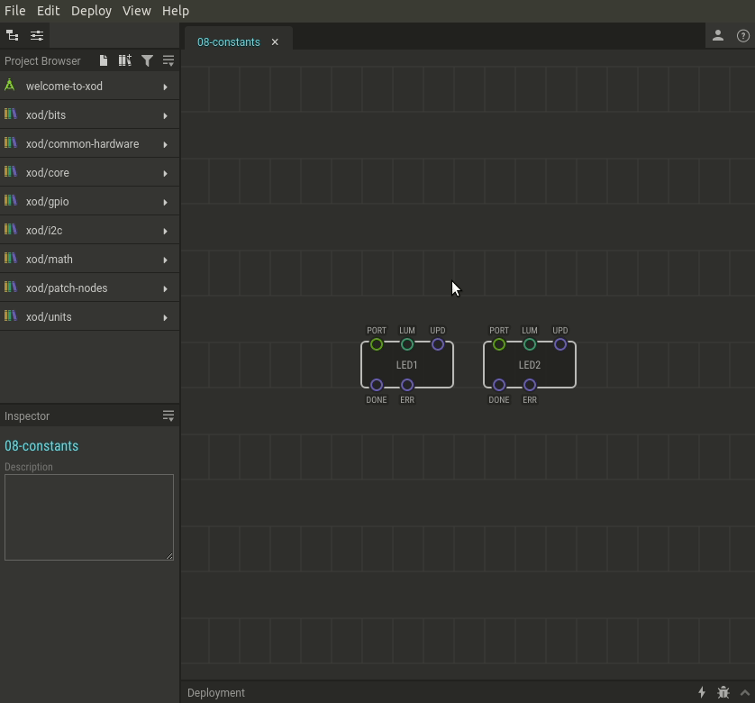

# #08. Constant Nodes

Note
This is a web-version of a tutorial chapter embedded right into the XOD IDE.
To get a better learning experience we recommend to install the
<a href="/downloads/">desktop IDE</a> or start the
<a href="/ide/">browser-based IDE</a>, and you’ll see the same tutorial there.

You can specify pin values manually with the Inspector. However, the data can
be transferred from the output pin of one node to the input pin of another
node. This is the core idea of XOD programming.

The simplest source of output values is a constant node. Its output value
never changes during the program execution. Although, while programming you
can set its value as usual, with the Inspector.

## Test circuit

Note
The circuit is the same as for the previous lesson.

[↓ Download as a Fritzing project](./circuit.fzz)

## How-to

1. Find the `constant-number` node under `xod/core` and add it to the patch.
2. Connect its `VAL` output pin with an input of another node. To do this,
   simply click on the `VAL` pin and then on the destination pin. You will then
   see a green line connecting the two pins. This line is called a *link*.
3. Set a desired constant value via Inspector.

[Next lesson →](../09-pot/)
