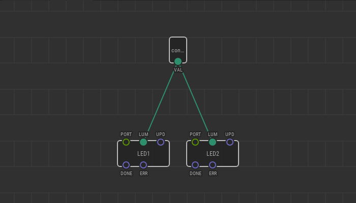
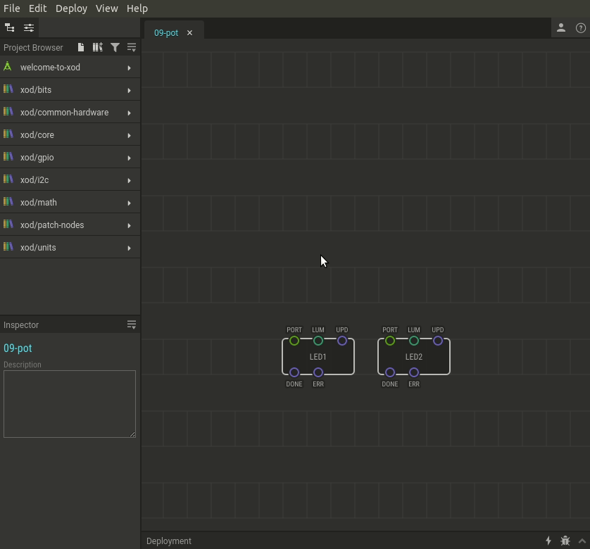

# #09. Input from a Potentiometer

Note
This is a web-version of a tutorial chapter embedded right into the XOD IDE.
To get a better learning experience we recommend to install the
<a href="/downloads/">desktop IDE</a> or start the
<a href="/ide/">browser-based IDE</a>, and you’ll see the same tutorial there.

Another ubiquitous source of values is a potentiometer (or simply “pot” for
short). It is very handy to adjust some parameters smoothly.

There is a special node `pot` to read values from a potentiometer. You will
find it in the `xod/common-hardware` library.

## Test circuit

[↓ Download as a Fritzing project](./circuit.fzz)

## How-to

1. Add the `pot` node to your patch.
2. Set the `PORT` pin value on the `pot` node to 0 if you have connected
   the potentiometer to Arduino port A0 as shown above.
3. Link the `pot` node `VAL` pin to input pins of nodes to control.

In our example, if you turn the potentiometer knob, it will affect the
brightness of the LEDs. Depending on the angle of the knob, the `pot` node
returns a value from 0.0 to 1.0 to the `VAL` pin, and that value is transferred
to the `LUM` pins of both LED nodes.

[Next lesson →](../10-math/)
