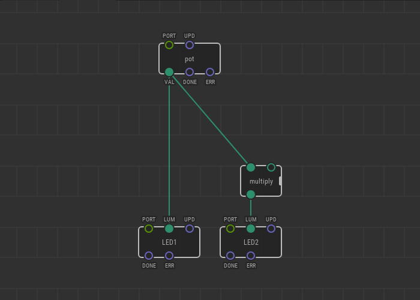
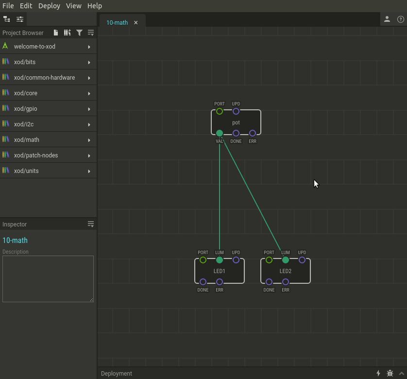

# #10. Doing Math

Note
This is a web-version of a tutorial chapter embedded right into the XOD IDE.
To get a better learning experience we recommend to install the
<a href="/downloads/">desktop IDE</a> or start the
<a href="/ide/">browser-based IDE</a>, and you’ll see the same tutorial there.

You probably noticed that pins have different colors.

The pin’s color indicates the *type* of data that this pin is compatible with.
Green pins can take and return numerical values. Blue pins work with pulses, a
special data type that we will return to later.

Let’s try to do some math.

As you can guess, the `multiply` node transfers the result of the multiplication
of the numbers from the input pins (`IN1` and `IN2`) to the output pin.

In `xod/core`, you will find nodes for different mathematical and trigonometric
calculations. Along with the `multiply` node, you will find `add`, `subtract`,
and `divide` for very basic computations.

## Test circuit

Note
The circuit is the same as for the previous lesson.

[↓ Download as a Fritzing project](./circuit.fzz)

## How-to

1. Add a new `multiply` or another math node to the patch.
2. Link its left input to the first value provider.
3. Set the right input value with the Inspector or link it to an output too.

Turn the potentiometer knob. If you have followed the example. The LED on port
11 will reach the maximum brightness with a half-turn of the knob. This happens
because the `multiply` node multiplied the input values and transferred them to
the `OUT` pin. As `IN2` was set to 2 in the Inspector, the value of the `pot`
node doubles before reaching the `LUM` pin of LED2.

[Next lesson →](../11-servo/)
