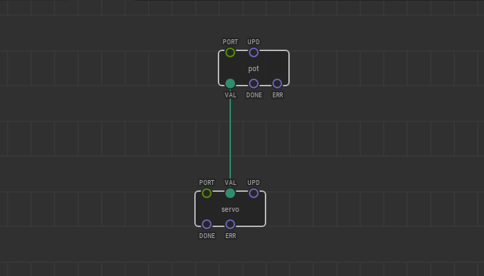

# #11. Controlling Servos

Note
This is a web-version of a tutorial chapter embedded right into the XOD IDE.
To get a better learning experience we recommend to install the
<a href="/downloads/">desktop IDE</a> or start the
<a href="/ide/">browser-based IDE</a>, and you’ll see the same tutorial there.

Controlling servos in XOD is just as easy as controlling LEDs. There is a
special node called `servo`. You will find it in `xod/common-hardware`.

Its `PORT` pin specifies the digital port on the Arduino that the servo is
connected to. The pin `VAL` accepts values ranging from 0 to 1; it turns the
servo shaft from 0 to 180°.

## Test circuit

Note
Although we don’t need the two LEDs used before in this particular lesson you
can leave them as is on your own breadboard. We’ll use them again in later
lessons. The same is true for any “disappearing” parts in next chapters.

[↓ Download as a Fritzing project](./circuit.fzz)

## How-to

1. Add a `servo` node to the patch
2. Set its `PORT` pin value
3. Link the `VAL` input to an output which provides value in range 0–1.

Turn the potentiometer knob, and watch the servo turn, too!

[Next lesson →](../12-help/)
