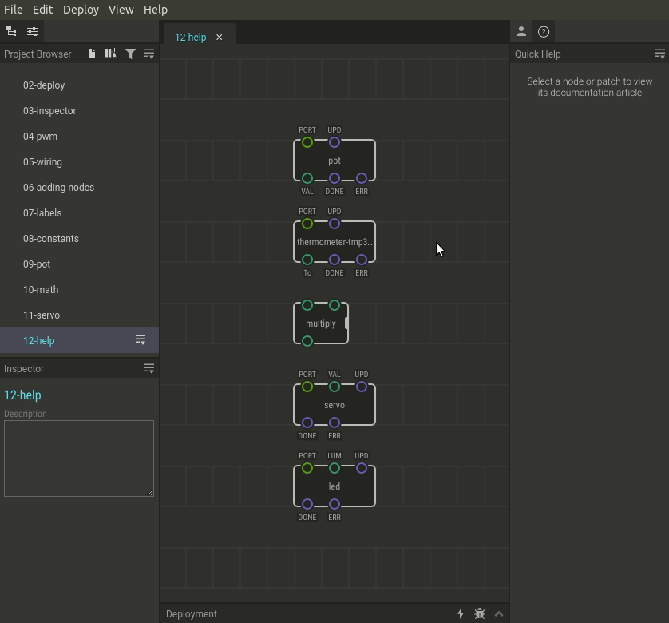

# #12. Accessing Help

Note
This is a web-version of a tutorial chapter embedded right into the XOD IDE.
To get a better learning experience we recommend to install the
<a href="/downloads/">desktop IDE</a> or start the
<a href="/ide/">browser-based IDE</a>, and you’ll see the same tutorial there.

There are many nodes in XOD. You can figure out which node does what by
yourself; you just need to read the help page. There you would also
details about pin value ranges.

## How-to

There are several ways to access a node help page.

* Select a node you’re interested in. Open the Helpbar either by clicking main
  menu item “View → Toggle Helpbar” or pressing the “H” key.
* Click the book icon in the Inspector or Project Browser to open the same
  help article in a web browser.

[Next lesson →](../13-map/)
