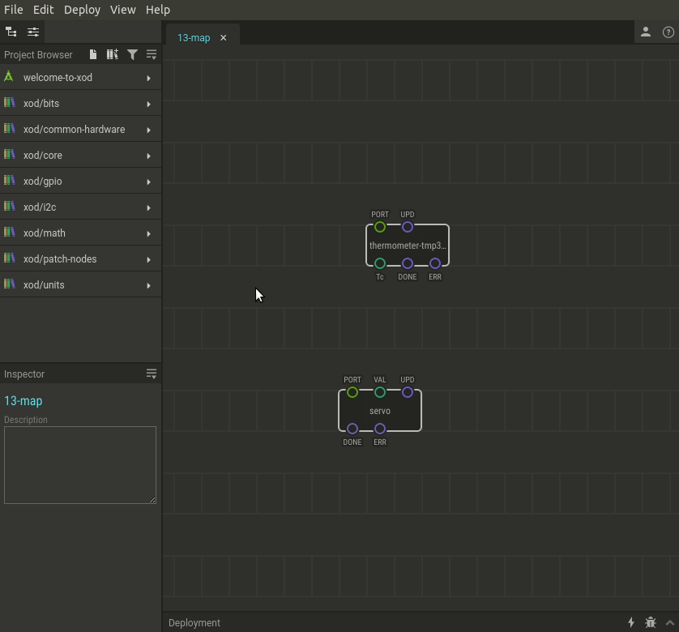

# #13. Mapping Values

Note
This is a web-version of a tutorial chapter embedded right into the XOD IDE.
To get a better learning experience we recommend to install the
<a href="/downloads/">desktop IDE</a> or start the
<a href="/ide/">browser-based IDE</a>, and you’ll see the same tutorial there.

If you have read the documentation page of the thermometer node, you will have
noticed that it provides an output temperature value to the `Tc` pin in degrees
Celsius. If we’re going to show the temperature with an arrow driven by a servo,
we’re in trouble. The `servo` node can work only with values ranging from 0 to
1 (0 is 0°, 1 is 180°).

The practical task is to make the servo rotate smoothly from 0 to 90°,
reflecting a temperature change from 20°C to 50°C.

You can actually do this using few math nodes, but XOD has a special node for
such cases. This node is called the `map` node.

The node has pins:

* `X` — the input value that needs to be transformed;
* `Smin` — the lower bound of the input range;
* `Smax` — the upper bound of the input range;
* `Tmin` — the lower bound of the transformed value;
* `Tmax` — the upper bound of the transformed value;
* `Xm` — the mapped (transformed) value.

Setting them properly would map an input from one range to an output in another.

## Test circuit

Note
The circuit is the same as for the previous lesson.

[↓ Download as a Fritzing project](./circuit.fzz)

## How-to

1. Add the `xod/math/map` node to your patch.
2. Link the `X` input to a value to be mapped.
3. Set input (source) range bounds with `Smin` and `Smax` (e.g. 20 and 50).
4. Set output (target) range bounds with `Tmin` and `Tmax` (e.g. 0 and 0.5).
5. Use `Xm` as the resulting value in the new range.

If you followed the example try to heat the thermometer with a hot object (i.e.
a paper knife heated with a lighfire). At a temperature of 35°C (half the input
range), the servo should rotate to 45°, which is half the output range.

[Next lesson →](../14-map-adjust/)
