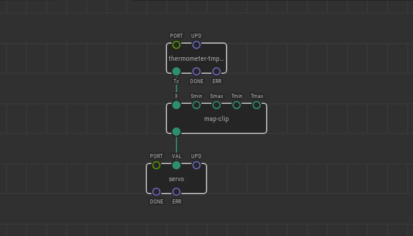

# #14. Adjusting Map Range

Note
This is a web-version of a tutorial chapter embedded right into the XOD IDE.
To get a better learning experience we recommend to
<a href="../install/">install the IDE</a>, launch it, and you’ll see the
same tutorial there.

After the previous lesson, the `map-range` node linearly maps the
20–50°C range to the 0–90° servo rotation. Let’s raise the sensitivity.
Say, we want to map 15–30°C to 0–90° rotation.

However, what will happen if the `X` pin of the `map-range` receives data that
is outside the input range (10 or 42, for example)? The output value which is
a servo angle will fall outside the desired range too.

For such cases there is a sibling node called `map-clip-range`. It works the
same way, but any input that is out of range will be rounded to `Smin` or
`Smax`.  Thus, if `X` receives a value of 10, the `map-clip-range` node will
accept it as 15, and 42 will be accepted as 30.

## Test circuit

Note
The circuit is the same as for the previous lesson.

[↓ Download as a Fritzing project](./circuit.fzz)

## How-to

Just use the `map-clip-range` instead of the `map-range` if you want the
output range to be guaranteed.

If you prefer °F, you can easily translate the data from the
thermometer with the `c-to-f` node from `xod/units`. The range will be
59–95°F.

[Next lesson →](../15-buttons/)
