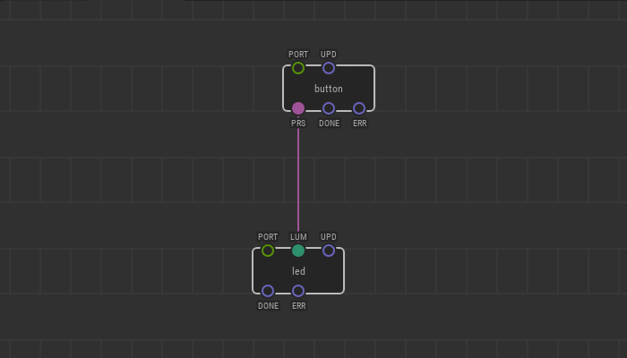
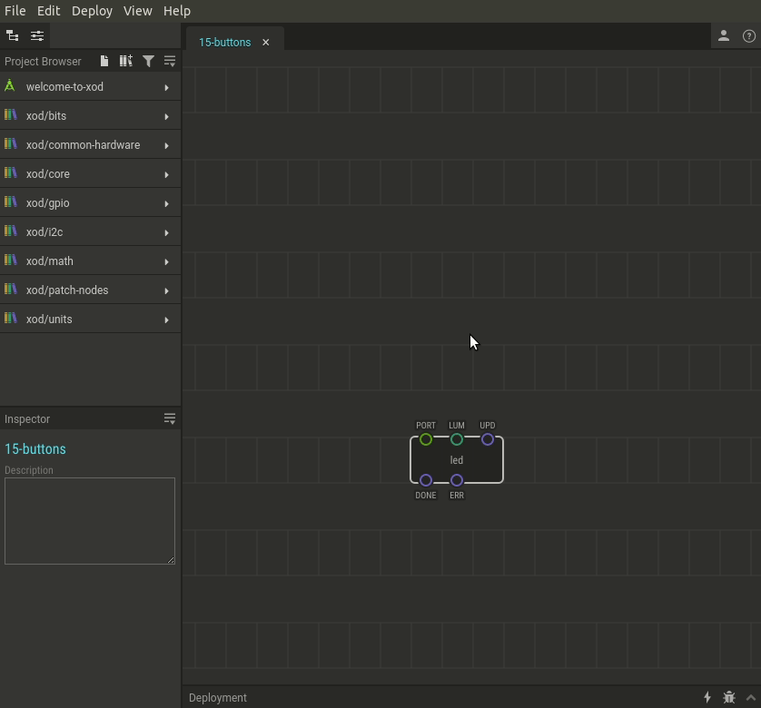

# #15. Buttons

Note
This is a web-version of a tutorial chapter embedded right into the XOD IDE.
To get a better learning experience we recommend to
<a href="../install/">install the IDE</a>, launch it, and you’ll see the
same tutorial there.

So, buttons! They could be read with a `button` node from `xod/common`
hardware. The node makes all the work related to signal debouncing so that
you have not to bother about it.

The button node has a purple output pin called the `PRS`. This pin returns a new
type of data: *boolean*.

Boolean data can have either of two values: true or false.
In our case, the `button` node returns a value of `false` when idle and `true`
while the button is being pressed.

Good news, in XOD boolean and number data types are compatible. Here are two
rules of datacasting:

* Boolean-to-number: if you send a boolean false to a numeric (green) input, it
  will be interpreted as a numeric 0; if you send a boolean true, it will be
  interpreted as a numeric 1.
* Number-to-boolean: if you send any numeric value except 0 to a boolean
  (purple) input; it will be interpreted as true, and if you send 0, it will be
  interpreted as false.

## Test circuit

[↓ Download as a Fritzing project](./circuit.fzz)

## How-to

Let’s bind a button with the LED.

1. Add a `xod/common-hardware/button` node.
2. Set the `PORT` value.
3. Link the `PRS` button output to the destination pin (`LUM` of the `led` in
   our example).

Now, when you press the button the `button` node sets the `PRS` pin to `true`,
the `led` node (`LUM` pin) interprets it as 1, and the LED turns on at full
brightness.

[Next lesson →](../16-logic)
