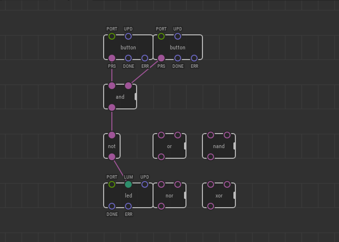

# #16. Logic Nodes

Note
This is a web-version of a tutorial chapter embedded right into the XOD IDE.
To get a better learning experience we recommend to install the
<a href="/downloads/">desktop IDE</a> or start the
<a href="/ide/">browser-based IDE</a>, and you’ll see the same tutorial there.

Boolean values are cool. You can use them to construct complex logic systems.
In XOD, you will find a lot of nodes for this purpose. All of them are located
in `xod/core`.

* `and` returns `true` if both inputs (`IN1` *and* `IN2`) are `true`
* `or` returns `true` if `IN1`, `IN2`, or both are `true`
* `xor` returns `true` if only one of `IN1` and `IN2` is `true`
* `not` inverts the input value
* `nand` is an inverted `and`
* `nor` is an inverted `or`

## Test circuit

[↓ Download as a Fritzing project](./circuit.fzz)

In the example patch above the `and` node returns `false` until both buttons
are pressed. The `not` node inverts the value from the `and` node, so the `LUM`
pin receives its `true` value (1). Thus, the LED turns on.

Pressing one of the buttons changes nothing. The LED will turn off only when
the `LUM` pin receives false (0). This will happen only if the `not` node
receives the true value, which is possible only if both buttons are pressed at
the same time.

[Next lesson →](../17-ldr/)
