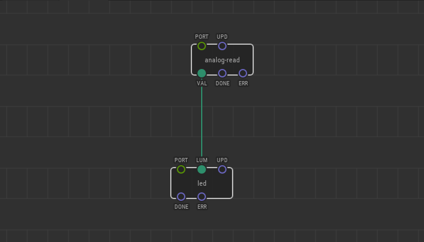

# #17. Reading lightness

Note
This is a web-version of a tutorial chapter embedded right into the XOD IDE.
To get a better learning experience we recommend to
<a href="../install/">install the IDE</a>, launch it, and you’ll see the
same tutorial there.

Let’s introduce a new sensor to measure an ambient light level.  A
photoresistor (aka light dependent resistor or LDR) would do a great job of
measuring the parameter. However, there is a small problem: we do not have a
photoresistor node in XOD.

Yet, we have basic nodes for working with the digital and analog ports of the
Arduino. A photoresistor is a pretty primitive device, and all we need to do is
read its value from the analog port on the Arduino. To do so, we will use an
`analog-input` node.

It is a low-level node that reads an analog port of Arduino directly and
outputs the value measured in 0–1 range where 0 corresponds to 0 volts (value
of 0 in the Arduino native language) and 1 corresponds to the power voltage
(usually 5 or 3.3 volts; value of 1023 in C++).

## Test circuit

[↓ Download as a Fritzing project](./circuit.fzz)

Try to create a device as shown above, cover the photoresistor with your hand,
and watch how the brightness of the LED changes.

[Next lesson →](../18-comparisons/)
