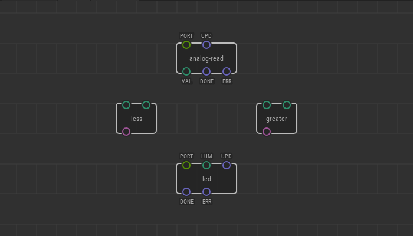
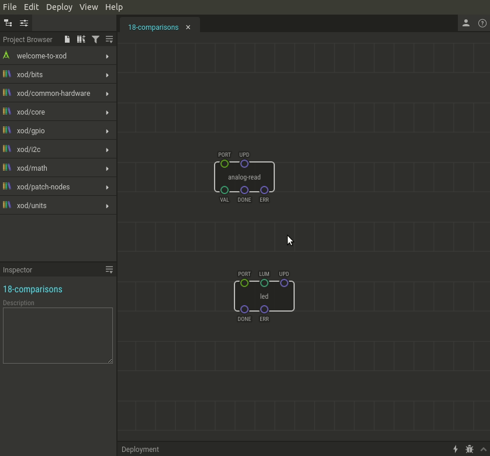

# #18. Comparing Numbers

Note
This is a web-version of a tutorial chapter embedded right into the XOD IDE.
To get a better learning experience we recommend to install the
<a href="/downloads/">desktop IDE</a> or start the
<a href="/ide/">browser-based IDE</a>, and you’ll see the same tutorial there.

Now, let's learn how to work with conditionals in XOD.

We will measure a lightness level, and if the values exceed or are below the
threshold, we will turn an LED on or off.

XOD has `greater`-than and `less`-than nodes to do simple
mathematical comparisons. They are in `xod/core`.

The `LHS` and `RHS` pins receive numbers to compare, and output pins return
the comparison result expressed as a boolean value (true or false).

## Test circuit

Note
The circuit is the same as for the previous lesson.

[↓ Download as a Fritzing project](./circuit.fzz)

## How-to

* Place a `xod/core/less` (or `greater`) node to trigger an action when
  a measured parameter goes under (or over) a threshold value.
* Use the `LHS` pin to link the value measured.
* Set the threshold as the `RHS` pin value.
* In cases where figuring out the proper threshold is tricky use a value
  from a potentiometer to adjust it dynamically.

In the example shown, if the `analog-input` node (our photoresistor) returns a
value greater than the threshold, the `greater` node will set the `GT` pin to
`true`, and the LED will turn on.

[Next lesson →](../19-if-else/)
