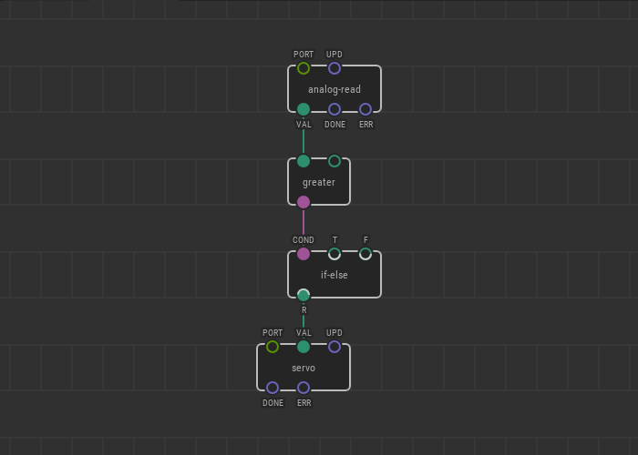

# #19. If-else branching

Note
This is a web-version of a tutorial chapter embedded right into the XOD IDE.
To get a better learning experience we recommend to install the
<a href="/downloads/">desktop IDE</a> or start the
<a href="/ide/">browser-based IDE</a>, and you’ll see the same tutorial there.

All the comparison nodes return true or false.

Let's imagine that you need to turn the servo to a certain angle, for instance
to 45° when you receive true, and to 135° when you receive false. How can we
make that work?

There is an `if-else` node in `xod/core`. The `COND` pin of this node checks
the boolean input value. If `COND` receives true, the node sets the value
from the `T` pin to the `R` pin. When it receives false, it sets the value
from the `F` pin to the `R` pin.

Now simply set the `T` value to 0.25 and the `F` value to 0.75 to make things
work.

## Test circuit

[↓ Download as a Fritzing project](./circuit.fzz)

Now, if the comparison condition is true, the servo will turn to the angle from
the `T` pin of the `if-else` node or, otherwise, to the angle set in the `F`
pin of the same node.

[Next lesson →](../20-fade/)
