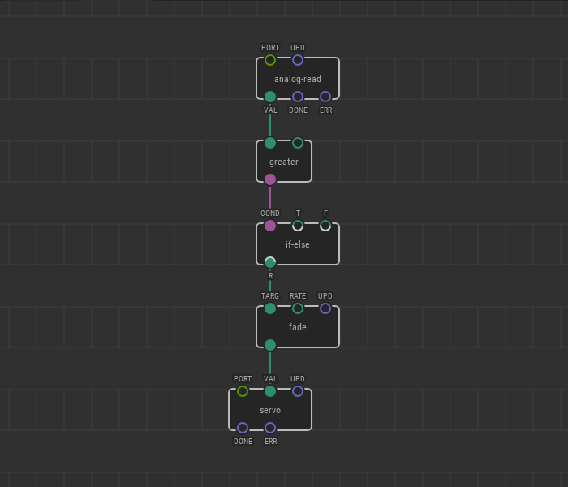
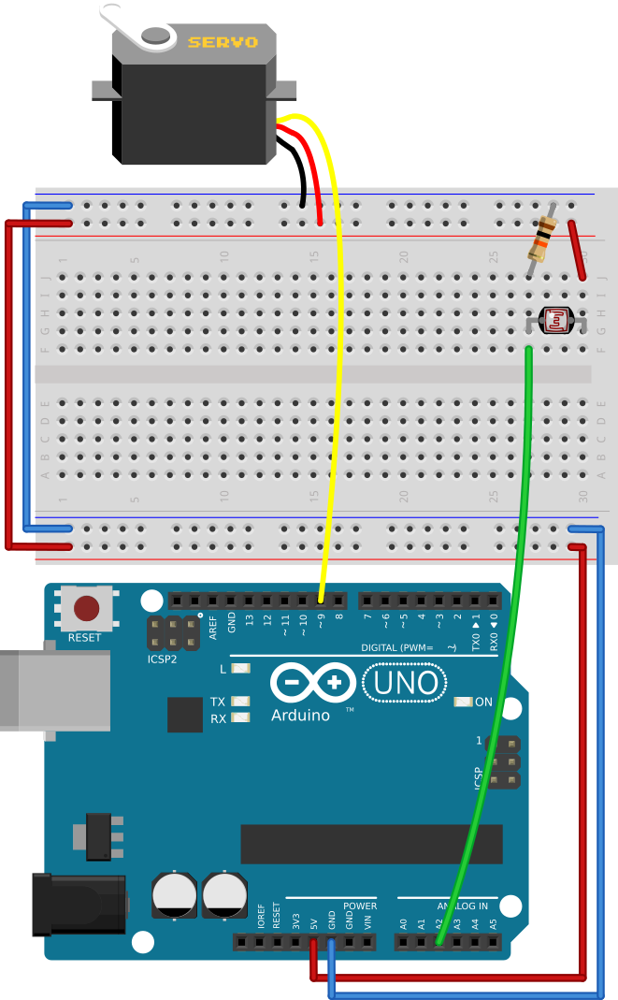

# #20. Smoother Changes

Note
This is a web-version of a tutorial chapter embedded right into the XOD IDE.
To get a better learning experience we recommend to
<a href="../install/">install the IDE</a>, launch it, and you’ll see the
same tutorial there.

In the previous examples our servo turns to the set angle at its maximum speed.
High speed is not always necessary and can damage the servo itself if the shaft
hits an obstacle.

Let’s improve our patch by making the servo move more smoothly. To achieve
that, we’ll need to set the `VAL` pin value along with a series of transitional
values. There’s a node for that, and it's called `fade`.

The `fade` node is in `xod/core`. This node returns a smooth series of
transitional values, so it will smoothen our servo motion.

* The `TARG` pin waits for a target value.
* The `RATE` pin is a number that defines amount of change for the transitional
values per each second.

The output pin returns 0 at the start of the program. Then, it starts to move
toward the `TARG` value by the `RATE` steps. The value of the output pin is
saved, so if the `TARG` value changes, the output will start to move to this
value from the last one returned.

## Test circuit

Note
The circuit is the same as for the previous lesson.

[↓ Download as a Fritzing project](./circuit.fzz)

Now, the servo will turn at a speed of 18° per second (0.1 = 18°).

The End

Congratulations! You’ve completed the crash-course tutorial. Now you are
officially a Xoder. Welcome on board!

Actually, the tutorial is not ready 100% yet and will grow.  Meantime, read <a
href="/docs/guide/">guide</a> articles to learn XOD better and feel free to ask
any questions and give feedback on our <a
href="https://forum.xod.io">forum</a>.

