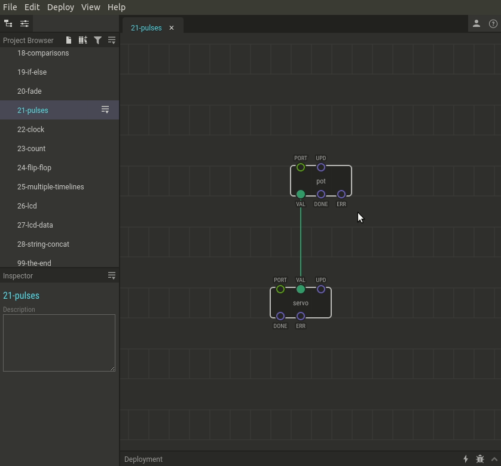

# #21. Pulses

Note
This is a web-version of a tutorial chapter embedded right into the XOD IDE.
To get a better learning experience we recommend to install the
<a href="/downloads/">desktop IDE</a> or start the
<a href="/ide/">browser-based IDE</a>, and you’ll see the same tutorial there.

In the [tenth chapter](../10-math/), we briefly mentioned the blue `UPD` input
pin and the *pulse* data type.

This type is very different from all the others. All values in the XOD are
transferred to the links continuously, even if the values haven't changed.  The
pulse data type is different. Imagine something like a flash. It’s basically a
message to trigger something else. It does not transmit any data. However, it
is useful when you need to convey that an event has occurred or tell something
else to work.

For example, say you only want an `analog-sensor` node to receive information
from a board port at certain intervals, and not all the time. This frequency
can be set with the help of pulses.

Each time a pulse arrives on the `UPD` pin, the node reads the analog port and
outputs the value to the `VAL` pin. This value will be stored there until it
changes to another value.

The behavior of the `UPD` pin can also be set in the Inspector. For a pot the
choice means:

* `Never`: Never produce pulses, i.e. Do not take readings from the analog port
  at all.
* `On boot`: Generate a pulse once at startup. We will update the state exactly
  once.
* `Continuously`: Generate pulses constantly, i.e. take the readings from the
  analog port with the highest possible rate.

## Test circuit

[↓ Download as a Fritzing project](./circuit.fzz)

## How-to

1. Open the Inspector for the `pot` node.
2. Change the `UPD` value to `On boot`.
3. Upload the patch to the Arduino.

Turn the potentiometer knob and press the reset button on the board itself.
Note, the potentiometer updates now only once when the Arduino is turned on.

[Next lesson →](../22-clock/)
