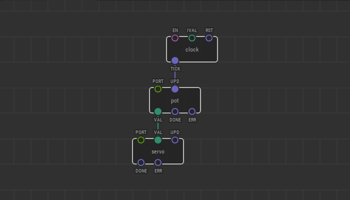
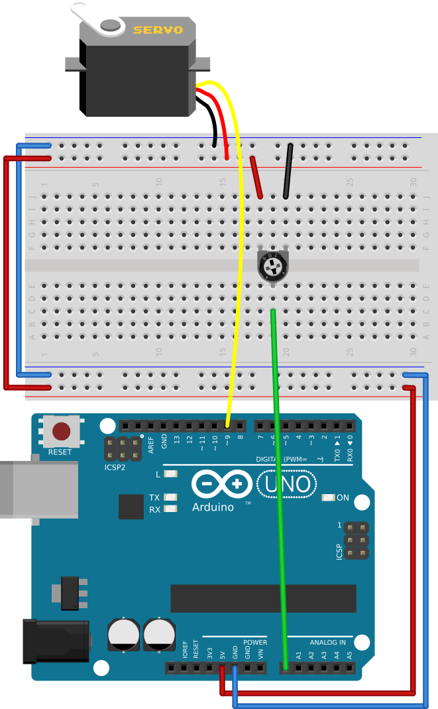

# #22. Clock Node

Note
This is a web-version of a tutorial chapter embedded right into the XOD IDE.
To get a better learning experience we recommend to install the
<a href="/downloads/">desktop IDE</a> or start the
<a href="/ide/">browser-based IDE</a>, and you’ll see the same tutorial there.

Many tasks require you to set a specific frequency for the pulse generation.

For this, we need a new node `clock`. It can produce pulse signals at time
intervals specified by the `IVAL` pin. This way, we can control the frequency
of data collection from our sensors.

Try to set the `IVAL` pin in the `clock` node to `2`. This means that it will
send a pulse every two seconds.

## Test circuit

Note
The circuit is the same as for the previous lesson.

[↓ Download as a Fritzing project](./circuit.fzz)

Slowly turn the potentiometer knob. You will see that the readings are being
taken and the servo reacts to them every two seconds.

[Next lesson →](../23-count/)
