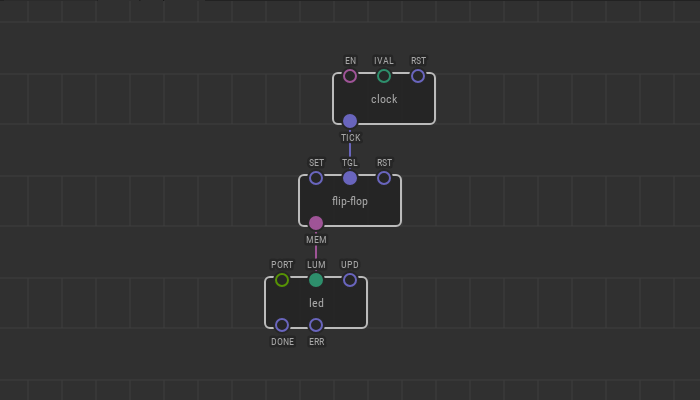

# #24. Flip-flop

Note
This is a web-version of a tutorial chapter embedded right into the XOD IDE.
To get a better learning experience we recommend to install the
<a href="/downloads/">desktop IDE</a> or start the
<a href="/ide/">browser-based IDE</a>, and you’ll see the same tutorial there.

You can control the behavior of many nodes with pulses. A very useful node is
`flip-flop`. It acts like a virtual switch, whose states can be controlled by
pulses.

Let’s do a classic experiment: blink the LED.

Each time a pulse arrives at the `TGL` pin, the node toggles the boolean value
on the `MEM` pin from `false` to `true` and vice versa.

## Test circuit

[↓ Download as a Fritzing project](./circuit.fzz)

## How-to

1. Assemble the circuit with the LED. Do not forget to specify the desired port
   in the `PORT` pin.
2. Set the flashing frequency in seconds using `IVAL`.
3. Upload the patch to the Arduino.

The LED will turn on and off at the frequency you've chosen. Try to control
the flashing speed of the LED with a potentiometer. To do this, connect the
output of a pot node to the `IVAL` pin. Each time a pulse arrives at the `TGL`
pin, the node toggles the boolean value on the `MEM` pin from `false` to `true`
and vice versa.

[Next lesson →](../25-multiple-timelines/)
