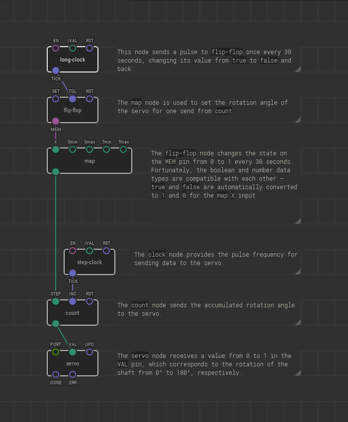
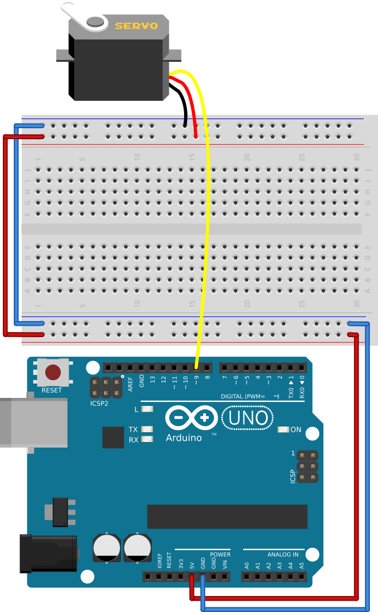

# #25. Using Multiple Timelines

Note
This is a web-version of a tutorial chapter embedded right into the XOD IDE.
To get a better learning experience we recommend to install the
<a href="/downloads/">desktop IDE</a> or start the
<a href="/ide/">browser-based IDE</a>, and you’ll see the same tutorial there.

By using multiple independent pulse signals, we can create complex
programs to control our devices. Here, we use two clock nodes to rotate the
servo in one direction and then the other.

The patch for this chapter is little bigger than what we've seen so far. A good
rule of thumb in XOD is to *read the patch from the bottom up*. That way you
can see the cause and effect relationship created by the flow of the patch.
First, you see the result and then what caused it!

Pay close attention to the `map-range` node. Instead of using it in the standard
manner, we are simply using it to flip the sign of the output value.

## Test circuit

[↓ Download as a Fritzing project](./circuit.fzz)

The servo should tick in one direction for 30 seconds and then in the other
direction for 30 seconds.

[Next lesson →](../26-lcd/)
