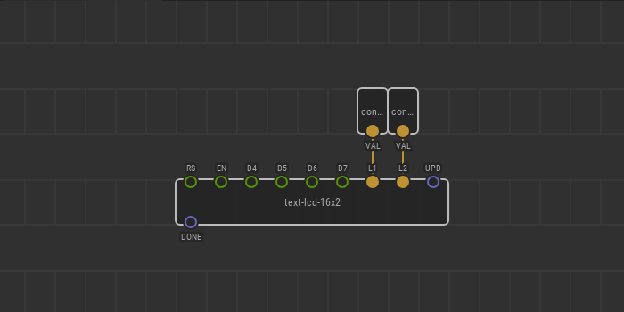
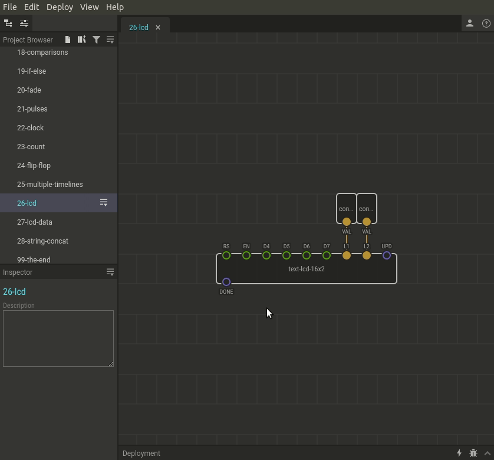

# #26. Showing Text on LCD

Note
This is a web-version of a tutorial chapter embedded right into the XOD IDE.
To get a better learning experience we recommend to install the
<a href="/downloads/">desktop IDE</a> or start the
<a href="/ide/">browser-based IDE</a>, and you’ll see the same tutorial there.

Brace yourself, because we are about to learn about the `text-lcd-16x2` node!
If you haven’t already guessed, this node is used to control 16x2 LCD screens.

Now, let’s concentrate on the two `constant-string` nodes. These nodes contain
and transmit data of type _string_. Yellow is used to indicate string type pins
and links. A string is just another name for a line of ordinary text. This
sentence is a string!

## Test circuit

Warning
Be careful, there are many connections so chances to make a mistake are high.
If you see no text, double check all connections and rotate the potentiometer
to adjust contrast.

[↓ Download as a Fritzing project](./circuit.fzz)

## How-to

You should now see “Hello world!” displayed on the screen. Cool? Try to
display your own message on the screen.

[Next lesson →](../27-lcd-data/)
