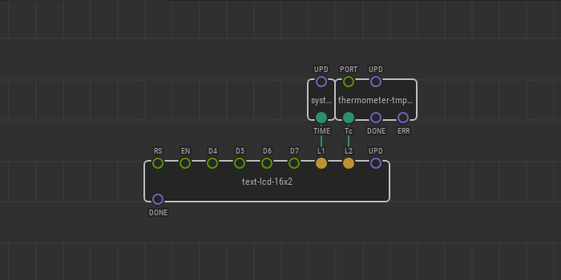
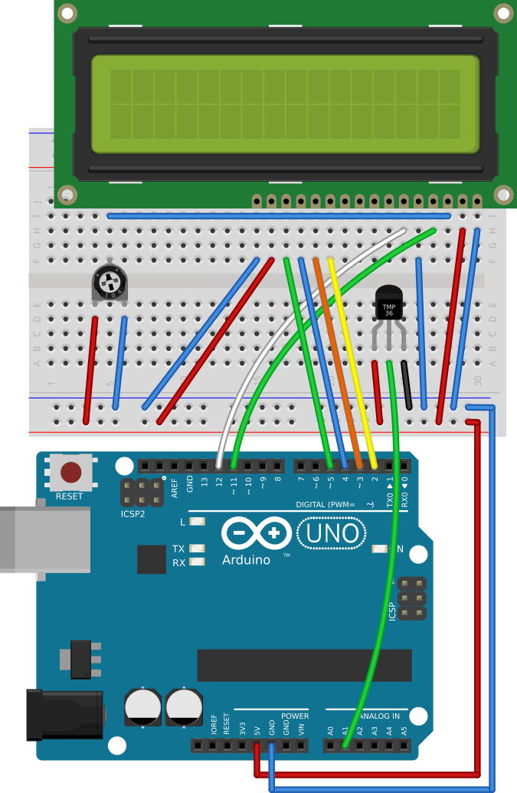

# #27. Displaying Sensor Values on LCD

Displaying static data on the screen is boring.  We have more important things
to see!

Let’s display something useful. For this example, let’s show the time from the
moment Arduino was started in seconds and the reading from the thermometer we
learned about earlier.

The number data type is compatible with the string data type. Sensor values can
be transmitted without additional conversions. They will be transmitted with an
accuracy of two decimal places. 

## Test circuit

[↓ Download as a Fritzing project](./circuit.fzz)

Now you have a portable thermometer.  Try to connect other sensors to reinforce
the skills.

[Next lesson →](../28-string-concat/)
