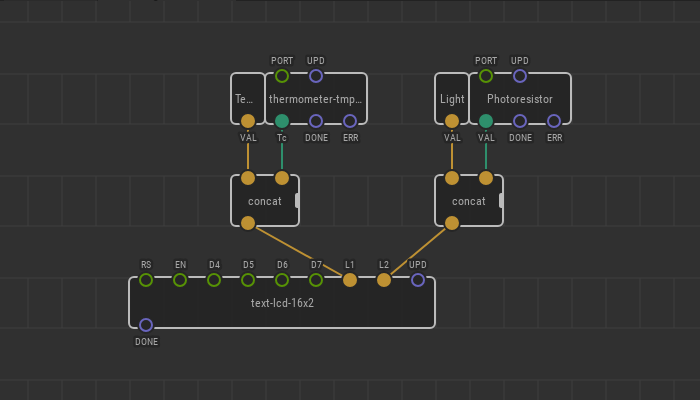
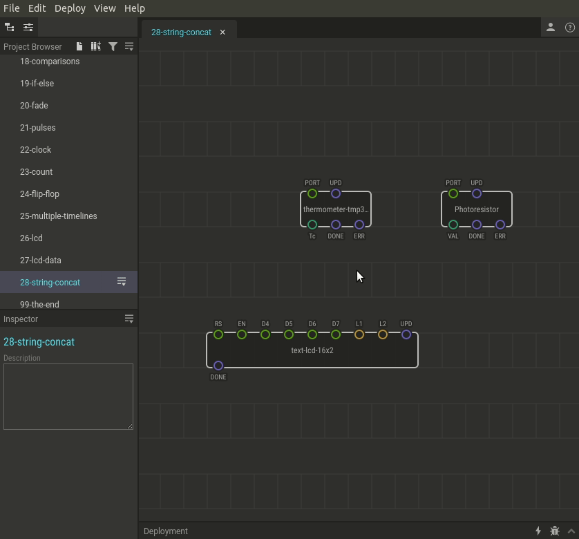

# #28. String Concatenation

We have already learned how to display readings from our sensors. But if we
have more than one sensor, we'll need a way to tell the readings apart.

The `concat` node will help us solve this problem.

Concat allows you to merge two strings into one. The new string will have the
input to the left pin placed in the beginning and the input to the right pin
placed at the end.

## Test circuit

[↓ Download as a Fritzing project](./circuit.fzz)

## How-to

1. Find the `constant-string` node in the library. Add one per string that
   never change. Alternatively, bind the desired value directly to a `concat`
   pin via Inspector.
2. Assign string values to each node using the Inspector. Try something like
   “Temp: ” and “Light: ” to keep things short. Put a space at the end
   so that when we combine it with another string they won't bunch up.
3. Link the `VAL` pins of the `constant-string` nodes to the left pins of the
   `concat` nodes. The `IN1` is the beginning of the line, it’s the first part.
4. Link the outputs of the thermometer and photoresistor to the right pins on
   the `concat` nodes. They will be the second part of the generated string.
5. Upload the patch to the Arduino.

Now, the readings from your sensors are displayed on the screen with a
convenient label!

## Try it yourself

Try to display the measurement label before the reading and the units of
measurement afterward. Use two more `concat` nodes for this. But remember, you
only have 16 characters per line.

Try to convert degrees Celsius to degrees Fahrenheit and label them accordingly.
You will find a clue for this task in [chapter #14](../14-map-adjust/).
