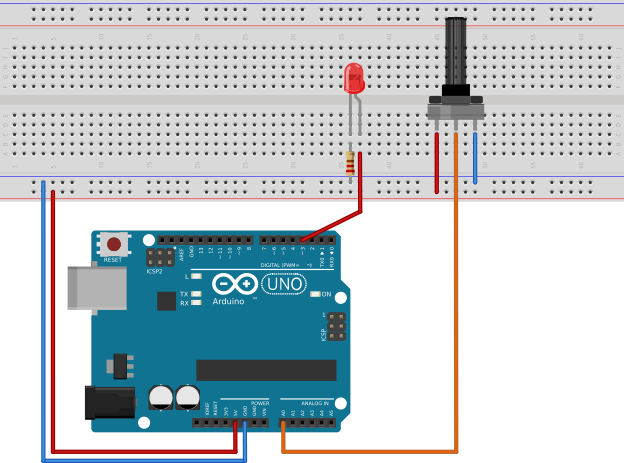
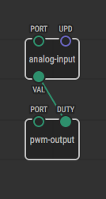
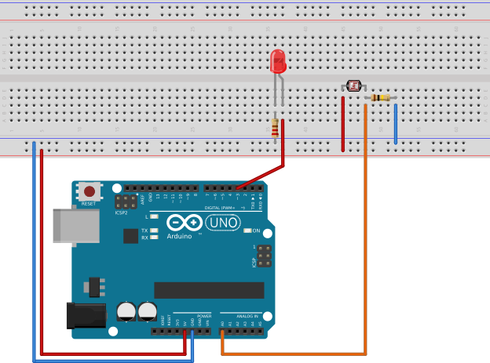
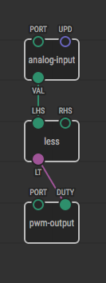
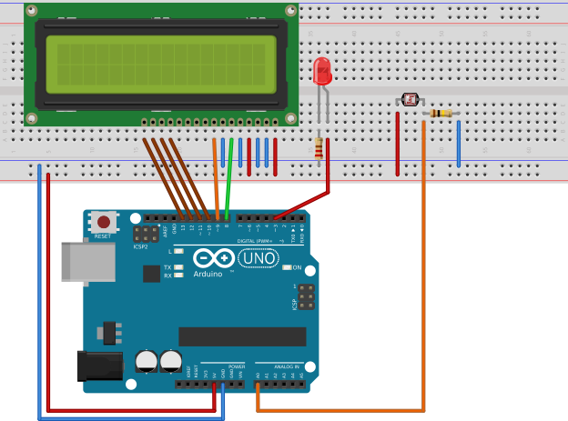
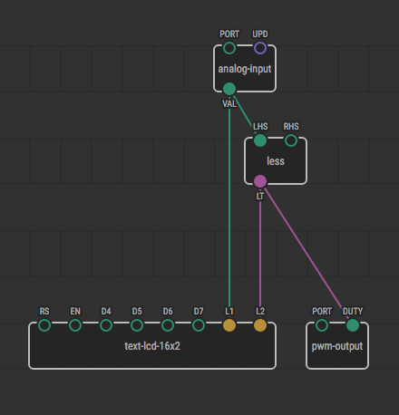
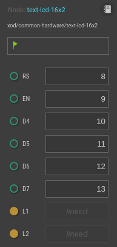

Data Types and Conversions
=======================================

In previous tutorial chapters, you’ve had to deal with pulses and logical
values. A pulse just denotes the fact something happened and logical values
carry either 0 (low) or 1 (high) value.

The latter is called a *boolean* data type, and its values are called boolean
values.  It’s just a matter of terminology, but the boolean value that
corresponds to 1/high/on/enable is called *true*, and the boolean value
corresponding to 0/low/off/disable value is called *false*.

XOD has other types to express more than a simple flow of boolean values.
Let's get familiar with them.

Number type
-----------

42, 3.14159, -2.7… All these are numbers. They can be used to describe values
like temperature, distance, angle, acceleration along an axis, and many more.

Let’s use few nodes that operate on numbers. We are going to build a simple
dimmer with a potentiometer that sets LED brightness. First of all, we need a
circuit:

We would like to control LED brightness, so be sure to connect the LED to a
port that supports PWM. They are marked with a tilda (~) on Arduino boards.
Because the potentiometer provides analog values, the port it is connected to
must be capable of reading analog signals. Ports marked A0 through A5 are a
good choice for that.

Then create a new project from the main menu: File → New Project. Name it
`pot-led-dimmer` or something like that. Add nodes and links to create a
program that looks like the one below:

We use `pwm-write` from `xod/gpio` to provide a PWM signal to our LED. The
`DUTY` input defines the duty cycle. The value 0.0 denotes the always-low
signal (LED is off), 0.33 is for a 33% cycle (one-third of full brightness),
0.5 is for 50% brightness, etc. up to 1.0 for the always-high signal when the
LED is 100% on.

Be sure to set the `PORT` input value to D3 with Inspector.

Next we use `analog-read` from `xod/gpio` to read values from the
potentiometer. Read values are available on its output `VAL` and take the value
0.0 for one of the potentiometer's limits, 1.0 for the other, and fractional
values for anything between them.

For the `PORT` value on the `analog-read`, use value 14 which corresponds to
pin A0 on the board.

XOD T0D0
Ports are currently represented as simple numbers. So you can’t enter a value
like `A0` directly. Just remember that A0 is 14 behind the scenes, A1 is 15,
A2 is 16, etc.

This inconvenience will be fixed in future versions of XOD.

In Inspector you’ll see “Continuously” as a value for `UPD` input. Leave it
as is. It controls how often the microcontroller should read values from
the analog port. “Continuosly” means as fast as it can. To save resources
you may control readings manually (e.g. with a `clock` node) but that’s
beyond our current requirements.

Now note that we have the `VAL` output of our potentiometer linked to the
`DUTY` input of our LED. They both operate on a *number type* in the range from
0.0 to 1.0, so no conversions are necessary and we link them directly.

Our program now runs like this:

- The controller reads potentiometer values as fast as it can
- The value is fed to the PWM output with the LED, causing it to update its
brightness.

Upload the program to your board and check out the result.

Compare to convert between numbers and booleans
-----------------------------------------------

Let’s slightly modify our device to make a smart light. It should turn on
when it’s too dark and turn off when it’s bright enough. To do this,
we’re going to replace the potentiometer with a simple LDR-based voltage
divider:

Now our A0 port provides number values that correspond to the brightness of the
ambient light. We should define a threshold value: if the value is under the
threshold, the LED should be on; otherwise it should be off. So we need to
somehow map a number value to a boolean value.

This is commonly done using the comparison nodes `less`, `greater`, `equal`
from `xod/core`. Let’s do it:

The `less` node compares the two numbers on the left hand side (`LHS`) and the
right hand side (`RHS`) and outputs true iff `LHS` < `RHS`. Set `RHS` to a
constant value using Inspector. The exact value depends on characteristics of
the resistors and desired darkness threshold. You could experiment a bit with
it. 0.5 should work fine as a starting value.

Hint
If you want to know what a particular node does you can access its description
with the Helpbar. Press `H` key or hit View → Toggle Helpbar to view it.

Upload the program. Make sure the LED is off when the device starts. If not,
adjust the threshold value. Then cover the LDR with your hand to simulate
darkness. The LED should turn on.

Look at the program again. Notice that we don’t tell our LED to turn off if
some condition met and then turn off against based on another computation.
Instead, we hard-wire our node's pins, making the behavior explicit and easy
to understand. That’s what differentiates XOD's functional/reactive paradigm
from conventional programming like C.

String type
-----------

Now you are familiar with pulses, booleans, and numbers. XOD also provides a
string type. Strings are used to represent pieces of textual data. They may
represent single or multiple lines, and can even be empty.

`"Hello world!"` is a string. `""` is an empty string. `"0.42"` is a string
too, though it contains only numeric characters and looks like a number at a
first sight.

Let’s improve our device to show the lightness level on an LCD screen. Use
any popular text LCD to build a circuit like one below:

Add the `text-lcd-16x2` node from `xod/common-hardware` and give it the value
of `analog-read` as an input for the first line (`L1`). Link the output of the
`less` node to the `L2` input.

Make sure to set port numbers in Inspector properly.

Now upload the program to the board. See how the data is displayed and updated
as you cover the sensor.

Note that the LCD's `L1` and `L2` inputs expect string values, but we linked
number and boolean values to them. This is possible because any type can be
automatically converted to a string. The reverse isn’t true.

What’s next
-----------

If you’re going to build a project that is more complex than trivial, a
program created on a single patch would be too complicated. XOD has a mechanism
that lets you easily create your own nodes from existing nodes. Learn how to do
it in the [Patch Nodes](../patch-nodes/) chapter.
