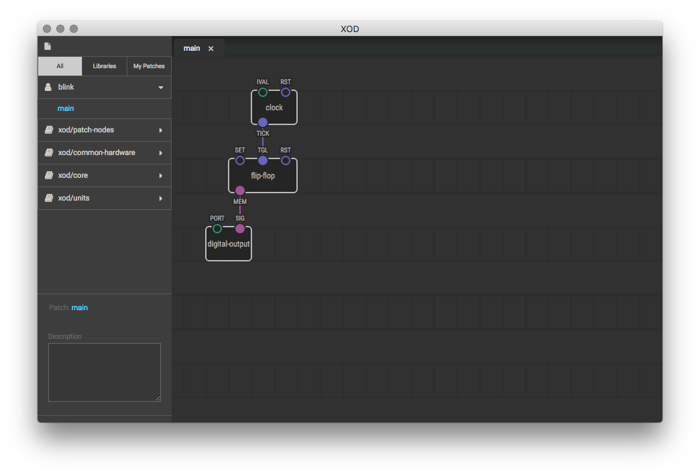
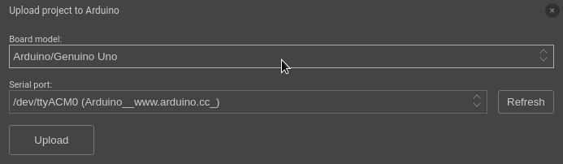
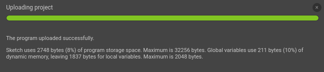

Installing and Running XOD
==========================

To work with XOD you would use XOD integrated development environment
(IDE for short). It comes in two flavors: browser-based version and
desktop version.

Browser-based IDE
-----------------

You can start [browser-based XOD IDE](/ide/) just by visiting the link.
However, since browser has few access permissions to computer’s file system and
USB-ports, its capabilities are quite limited.

Notably you can’t upload your program directly to the board from within browser
and you wouldn’t get convenient save/load functionality.

Although, you can import/export your programs as a single file (so called xodball)
and generate source code that you could copy and paste into Arduino IDE and then
upload it to the board via Arduino IDE.

Desktop IDE
-----------

XOD IDE for desktop requires installing but provides all features. It works on
Windows, macOS, and Linux. Find a distributive for your system on
[downloads page](/downloads/).

Upload your first program
-------------------------

Once you start XOD IDE you’ll see `welcome-to-xod` project open. It’s a primitive
demo project that—yes, you guess it—blinks a LED on the board.

Lets try to upload the program to your Arduino.

In main menu go to Deploy → Show Code for Arduino. You’ll see much of C++ source code 
that once compiled and uploaded to the board would blink built-in LED. If you have
Arduino IDE installed, try it, copy-paste the code to Arduino IDE and click Upload.

Note
If you’ve previously seen what code to blink a LED looks like for Arduino, you could
be astonished looking at the amount of code given by XOD. Don’t worry, most of it is
a code of XOD runtime environment which actually give little overhead after compilation.
And you haven’t to understand how it actually works. For now think about it as
of black box.

Upload directly from within XOD IDE
-----------------------------------

The feature is only available in desktop version. Go to Deploy → Upload to Arduino.
Select your board model and serial port it is connected to:

Click Upload. Hold on.

Behind the scenes XOD uses Arduino IDE to compile and upload programs. So if
you have no Arduino IDE installed yet, you’ll be asked to download and install
it. Arduino IDE itself has package system to support various boards. If a package
to support your board is not installed yet, it would be automatically installed
as well.

If upload succeeds you’ll see 100% progress and a message from compiler:

<Feedback>
If you have a problem with upload, please report about it on our
[forum](//forum.xod.io). Describe what you do, what you expect to get, and
what you actually get. We will help.
</Feedback>

What’s next
-----------

Now, when you can run IDE and upload programs, lets try to understand how and
why they work. Follow to [Nodes and Links](../nodes-and-links/) chapter.
