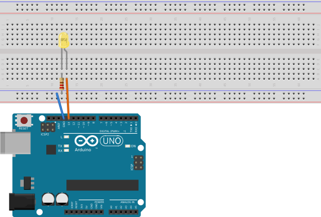
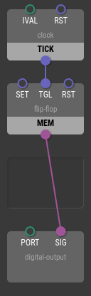
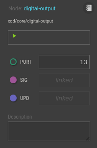
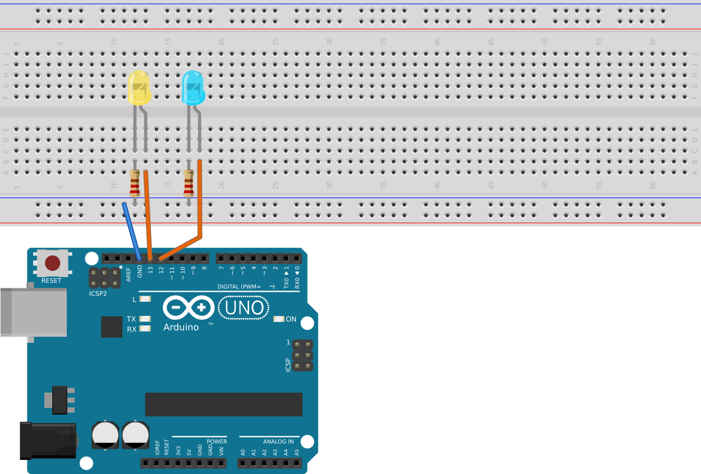
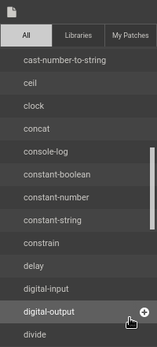
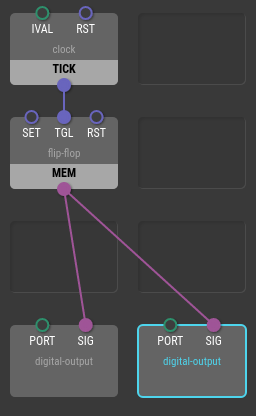
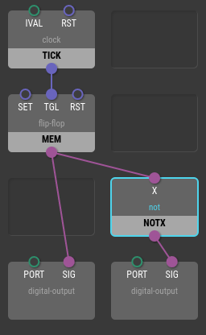
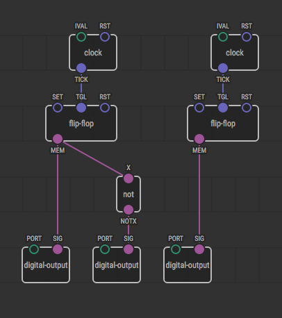
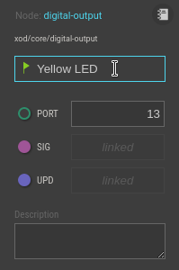
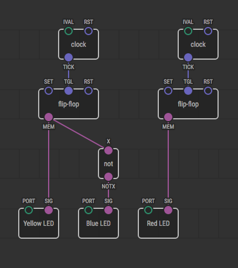

Nodes and Links
===============

Now let’s look closely on the demo project which opened up on IDE start. It
blinks the LED connected to pin 13 of your board. Although many boards have
a built-in LED on that pin, let’s make it more visible by building a simple
circuit:

Make sure you’ve uploaded the program to the board and the LED actually
blinks.

Why does it blink?

The nodes
---------

You see four *nodes* linked together in a chain to make this possible.
Nodes are basic building blocks in XOD. Each of them make a tiny portion
of work and communicate to others.

Let’s talk about each node one by one from bottom to top.

### digital-output

This node represents a single physical pin on the board that is used
as an output, and can be either in high (enabled) or low (disabled)
state. We use it to switch our LED on and off.

The node has three *inputs*. They are `PORT`, `SIG`, and `UPD`.

The `PORT` defines what physical pin corresponds to the node. Select
the node by clicking on it. You’ll see *Inspector* sidebar with
properties related to the selected node, i.e. our `digital-output`.

Note that `PORT` value is set to 13’th pin.

Value on `SIG` input defines wether the digital output port should
go high or low state. In Inspector you see its value disabled with
placeholder “linked”. That’s fine because the value is defined by
an upstream node it is linked to. More on that later.

Input `UPD` listens for *pulses* and used to actually update the signal and
physically update the physical pin according to `SIG` value. In other
words updating `SIG` value alone is not enough and wouldn’t lead to any
visible results.

Note

Although it could look excessive and strange at first, but <em>any</em> update in
the XOD program is accompanied by pulses. They’re like heartbeat which delivers
all updates to their destinations. No pulses, no observable effects.

Splitting actual values and pulses helps to understand what and when could
ever happen. That makes programs more explicit and reliable.

Finally, the `digital-output` node listens for pulses on its `UPD` pin and
once it get a pulse, it sets physical port 13 (`PORT`) to a state defined
by a value on the pin `SIG` at the moment when the pulse was recieved.

### flip-flop

This node is like a virtual light switch that could be turned on (`SET`),
turned off (`RST`) or inverted to an opposite state (`TGL`).

In addition to its inputs the `flip-flop` has two *outputs*. They are
`MEM` which provides current state (high or low) and `CHNG` which sends a
pulse right when value of `MEM` changes.

### clock

The `clock` node emits a pulse on `TICK` output over equal periods of time.
The period is defined by the value of `IVAL` input.

Select the `clock` node and note the value set for `IVAL` in Inspector.
The interval is set up in seconds.

The second input `RST` accepts pulses. On pulse the clock accept new interval
value and start counting from scratch.

Clock is a very usual source of pulses. You’d use it quite often to drive
updates in your programs.

### boot

The `boot` node is very simple. It sends a single pulse when program starts,
i.e. when the board gets powered on, resetted or reflashed.

Hint

If pulses are heartbeats, then the clock is a heart. And the boot is a
defibrillator that starts the clock-heart.

The links
---------

You see that inputs and outputs of the nodes are connected together with lines.
These lines are called *links* in XOD.

They make it possible for nodes to talk to each other. Upstream nodes produce
values and downstream nodes consume that values.

What happens in our blink program? Take a look:

1. The `boot` node emits a pulse on program start
2. The pulse goes to the `clock` node which start to tick at regular intervals
3. Each tick pulse goes to the `flip-flop` and toggles its state
4. The `flip-flop` provides its state value to the `digital-output` and asks
   it to actually update by sending a pulse on each state update.

As a final result we see the LED blinking.

Tweaking the program
--------------------

Try to change something.

Select the `clock` node and set another `IVAL` value. Say, set it to 1.0 seconds,
upload the updated program and observe the result.

That’s not too interesting. Let’s add another LED. Improve your circuit:

Place new node of type `digital-output`. To do this use Project Browser sidebar.
The `digital-output` is available in `xod/core` library. Hover the cursor over
the item and click on (+).

You’ll see new node appeared in the main work area. Drag it to a slot you want.
The one next to existing `digital-output` would be fine. In Inspector set `PORT`
for the new node to 12 since it should control our new LED.

Now we need to provide the new node with data. Link its `SIG` and `UPD` pins to
`flip-flop` outputs:

Upload the updated program to the board. Whoa! Both LED’s are blinking.

Now let’s improve our program another bit and make the lights opposite. To do
this we should cut signal inversion into either of `digital-output` `SIG` links.
Node `not` under `xod/core` does exactly that. Delete existing link, place `not`
node and add new links so that signal from our `flip-flop` to `digital-output`
goes through it:

Upload the new version to the board. See the result?

Disjoint graphs and independent tasks
-------------------------------------

In XOD nodes are not required to be connected in a single network. You can build
two or more disjoint clusters of nodes to perform several tasks simultaneously.

Try to add yet another LED with absolutely independent blink interval and state:

Now we have three `digital-output`’s. It could be hard to understand which one
corresponds to what LED so it would be better to give them clear labels. To set
a custom label for a node select it and provide the label via Inspector:

You can provide a custom label for any node. Now the program could look more
clear:

What’s next
-----------

You’ve seen pins and links that carry values of different types. Some provide
logical values and some transmit pulses. They are differentiated by colors.
There are more data types in XOD. Follow to [Types and
Conversions](../data-types-and-conversions/) chapter to learn more on this topic.
